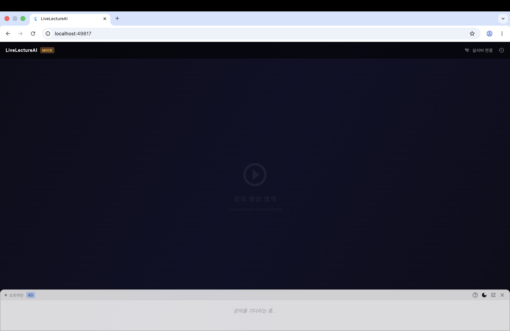
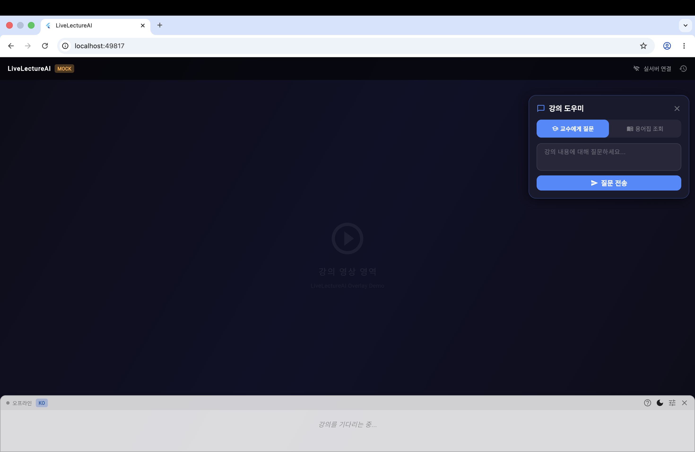

<p align="center">
  
</p>

<p align="center">
  
  
  
  
  
  
</p>

<p align="center">
  <b>Frontend</b><br/>
  <b>강의 상호작용을 위한 Flutter 기반 실시간 자막·질문 위젯 개발</b>
</p>

<p align="center">
  <b>🇰🇷 한국어</b>
  ·
  <a href="docs/README_en.md">🇺🇸 English</a>
  ·
  <a href="docs/README_jp.md">🇯🇵 日本語</a>
</p>

> [!IMPORTANT]
> 이 저장소의 `Frontend` 폴더는 **LiveLectureAI의 학생용 Flutter 프론트엔드 위젯 앱**을 다룹니다.  
> 백엔드 서버, STT/LLM 모델, 데이터베이스 구성은 `App` 폴더 또는 백엔드 문서를 참고해 주세요.

---

### 📺 프론트엔드는 무엇을 하나요?

<b>사용자가 실제로 보는 화면이에요.</b>

강의 화면 위에 아래 기능들을 띄우는 역할이에요.

* 실시간 자막 보기
* 번역 자막 보기
* AI에게 강의 내용 질문
* 새 질문 시작
* 저장된 강의 용어 검색
* 지난 자막 다시 보기
* 자막 크기, 위치, 투명도 설정

현재 프론트엔드는 백엔드와 주요 연결 테스트 대부분 완료
남은 단계는 실제 마이크 음성 입력 연동

---

### 📚 목차

* [주요 기능](#-주요-기능)
* [화면 미리보기](#-화면-미리보기)
* [현재 연동 상태](#-현재-연동-상태)
* [시작하는 방법](#-시작하는-방법)
* [환경 변수](#-환경-변수)
* [프로젝트 구조](#-프로젝트-구조)
* [개발 명령어](#-개발-명령어)
* [테스트 방법](#-테스트-방법)
* [다음 작업](#-다음-작업)

---

### ✨ 주요 기능

| 기능                   | 설명                           | 현재 상태 |
| -------------------- | ---------------------------- | ----- |
| 실시간 자막 오버레이          | 백엔드에서 받은 자막을 강의 화면 위에 표시     | 완료    |
| 번역 자막 표시             | 원문과 번역문 동시 표시                | 완료    |
| 강의 AI 질문             | 사용자가 입력한 질문을 백엔드 질문 API로 전송  | 완료    |
| 새 질문 시작              | 프론트 화면과 백엔드 질문 히스토리 동시 초기화   | 완료    |
| 용어집 조회               | 저장된 강의 용어 검색 및 표시            | 완료    |
| 자막 설정                | 자막 크기, 위치, 투명도, 테마 설정        | 완료    |
| 자막 히스토리              | 이전에 표시된 자막 재확인               | 완료    |
| Supabase Realtime 수신 | `new_caption` 이벤트 수신 후 자막 표시 | 완료    |
| 오디오 WebSocket 연결     | 백엔드 오디오 WebSocket 연결 확인      | 완료    |
| 실제 마이크 입력            | 마이크 음성을 직접 받아 백엔드로 전송        | 예정    |

---

### 🖼 화면 미리보기

<table align="center">
  <tr>
    <th align="center">실시간 자막</th>
    <th align="center">용어집 조회</th>
  </tr>
  <tr>
    <td align="center">
      <br/>
      <sub>수신된 자막의 강의 화면 위 표시</sub>
    </td>
    <td align="center">
      <br/>
      <sub>저장된 강의 용어 검색 및 확인</sub>
    </td>
  </tr>

  <tr>
    <th align="center">강의 AI 질문</th>
    <th align="center">자막 설정</th>
  </tr>
  <tr>
    <td align="center">
      <br/>
      <sub>강의 내용 기반 AI 질문</sub>
    </td>
    <td align="center">
      <br/>
      <sub>자막 크기, 위치, 투명도, 테마 조절</sub>
    </td>
  </tr>

  <tr>
    <th align="center">자막 히스토리</th>
    <th align="center">새 질문 시작</th>
  </tr>
  <tr>
    <td align="center">
      <br/>
      <sub>지나간 자막 재확인</sub>
    </td>
    <td align="center">
      <br/>
      <sub>이전 질문 흐름 초기화 후 새 질문 시작</sub>
    </td>
  </tr>
</table>

---

### 📡 현재 연동 상태

현재 프론트엔드 연동 확인 항목

| 항목                                          | 상태 |
| ------------------------------------------- | -- |
| 질문 API `/lecture/ask` 연결                    | 완료 |
| 질문 히스토리 초기화 API 연결                          | 완료 |
| 용어집 API `/lecture/glossary/{lecture_id}` 연결 | 완료 |
| Supabase Realtime 채널 구독                     | 완료 |
| `new_caption` 이벤트 수신                        | 완료 |
| 자막 오버레이 표시                                  | 완료 |
| 오디오 WebSocket 연결                            | 완료 |
| 실제 마이크 오디오 전송                               | 예정 |

확인된 Realtime 채널 구조

```text
channel = lecture_{lecture_id}
event = new_caption
```

프론트 수신 가능 자막 payload

```text
original_text / translated_text
original / translated
```

---

### 🚀 시작하는 방법

### 1. 필요한 환경

| 항목            | 설명              |
| ------------- | --------------- |
| Flutter       | 3.x             |
| Dart SDK      | Flutter 개발용     |
| Chrome        | Flutter Web 실행용 |
| 백엔드 서버        | FastAPI 서버      |
| Supabase 프로젝트 | Realtime 자막 수신용 |

---

### 2. 프로젝트 받기

```bash
git clone https://github.com/2022764025/Lecture-Hunter.git
cd Lecture-Hunter/Frontend
```

---

### 3. 패키지 설치

```bash
flutter pub get
```

---

### 4. 실행 환경 확인

```bash
flutter doctor
```

---

### 5. 프론트 실행

백엔드와 Supabase 연결 없이 화면만 확인할 경우

```bash
flutter run -d chrome
```

백엔드와 Supabase Realtime까지 연결할 경우

```bash
flutter run -d chrome \
  --dart-define=API_BASE_URL=http://127.0.0.1:8000 \
  --dart-define=WS_BASE_URL=ws://127.0.0.1:8000 \
  --dart-define=SUPABASE_URL=your_supabase_url \
  --dart-define=SUPABASE_ANON_KEY=your_supabase_publishable_or_anon_key \
  --dart-define=LECTURE_ID=demo-lecture \
  --dart-define=TARGET_LANG=Korean
```

---

### 🔧 환경 변수

`AppConfig` 기반 실행 환경값 관리

설정 파일

```text
lib/core/config/app_config.dart
```

사용 값

| 변수명                 | 설명                 | 예시                                      |
| ------------------- | ------------------ | --------------------------------------- |
| `API_BASE_URL`      | 백엔드 REST API 주소    | `http://127.0.0.1:8000`                 |
| `WS_BASE_URL`       | 백엔드 WebSocket 주소   | `ws://127.0.0.1:8000`                   |
| `SUPABASE_URL`      | Supabase 프로젝트 URL  | `your_supabase_url`                     |
| `SUPABASE_ANON_KEY` | 브라우저용 Supabase key | `your_supabase_publishable_or_anon_key` |
| `LECTURE_ID`        | 현재 강의 ID           | `demo-lecture`                          |
| `TARGET_LANG`       | 목표 언어              | `Korean`                                |

> [!IMPORTANT]
> 프론트에는 `sb_secret` 또는 `service_role` 키 사용 금지
>
> 브라우저용 anon public key 또는 publishable key 사용 필요

---

### 📁 프로젝트 구조

```text
Frontend/
├── pubspec.yaml
├── pubspec.lock
├── analysis_options.yaml
├── docs/
├── android/
├── ios/
├── web/
├── macos/
├── windows/
├── linux/
└── lib/
    ├── main.dart
    ├── core/
    │   ├── config/
    │   │   └── app_config.dart
    │   ├── constants/
    │   └── theme/
    ├── shared/
    │   └── widgets/
    ├── services/
    │   ├── api_service.dart
    │   ├── audio_stream_service.dart
    │   ├── sse_service.dart
    │   └── settings_service.dart
    └── features/
        ├── overlay/
        │   └── presentation/
        │       ├── pages/
        │       │   └── overlay_page.dart
        │       ├── widgets/
        │       └── controllers/
        ├── caption/
        │   └── presentation/
        │       ├── widgets/
        │       └── controllers/
        └── assistant/
            └── presentation/
                ├── panels/
                ├── widgets/
                └── controllers/
```

---

### 🧪 개발 명령어

### 패키지 설치

```bash
flutter pub get
```

### 코드 정리

```bash
dart format .
```

### 정적 분석

```bash
flutter analyze
```

정상 기준

```text
No issues found!
```

### Web 실행

```bash
flutter run -d chrome
```

### Web 빌드

```bash
flutter build web
```

---

### 🧩 테스트 방법

### 질문 API 테스트

프론트 질문 패널에서 질문 입력 시 아래 API로 요청

```text
GET /lecture/ask?lecture_id={lecture_id}&question={question}&target_lang={target_lang}
```

### 질문 히스토리 초기화 테스트

`새 질문 시작` 버튼 클릭 시 아래 API 호출

```text
POST /lecture/ask/reset?lecture_id={lecture_id}
```

### 용어집 테스트

용어집 탭 검색 시 아래 API 호출

```text
GET /lecture/glossary/{lecture_id}?keyword={keyword}
```

### Realtime 자막 수신 테스트

Supabase Realtime에서 아래 이벤트 수신 시 자막 오버레이 표시

```text
channel = lecture_demo-lecture
event = new_caption
```

테스트 payload 예시

```json
{
  "original_text": "Realtime integration final check.",
  "translated_text": "리얼타임 최종 연동 확인입니다.",
  "language": "en",
  "source_lang": "en"
}
```

### 오디오 WebSocket 테스트

프론트 오디오 전송 서비스 연결 주소

```text
ws://127.0.0.1:8000/ws/audio/{lecture_id}?target_lang=Korean
```

현재 연결 테스트 완료
실제 마이크 입력 전송은 다음 작업

---

### 🧭 다음 작업

* 실제 마이크 캡처 기능 구현
* 16000Hz Mono PCM16 오디오 변환 처리
* 실제 오디오 bytes WebSocket 전송
* STT 결과 Supabase Realtime broadcast 확인
* 실제 음성 자막 프론트 표시 통합 테스트
* Chrome Extension 적용 가능성 검토

