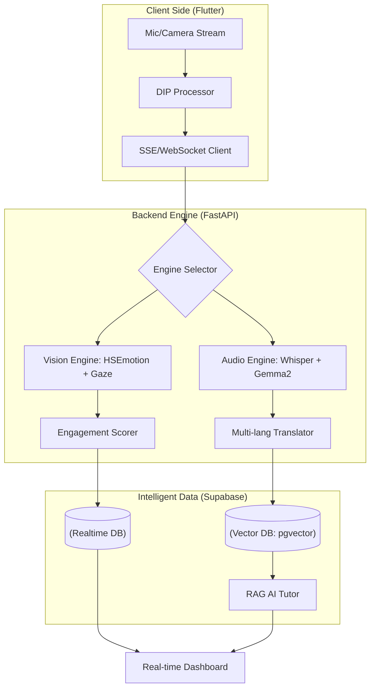

# 🎙️ LiveLectureAI
> **Empirical AI Development Project I** > **Task Hunter** | Flutter-based Real-time Subtitle & Question Widget for Enhanced Lecture Interaction

            

<p align="center">
    <a href="README.ko.md">
        
    </a>
    <a href="README.md">
        
    </a>
    <a href="README.zh.md">
        
    </a>
</p>

---

## 📄 Project Overview

### "A Flutter-based Real-time Captioning and Inquiry Widget for Enhanced Lecture Interaction"

This project aims to develop an AI-driven educational platform that utilizes multimodal analysis of instructors' lectures (audio/visuals) and students' reactions (emotions/gaze) to minimize the physical gap and optimize learning outcomes in real time.

---

## 🚀 Key Features (4 Pillars) ##

**📊 [Real-time] Anonymous Aggregation Dashboard**

- **Anonymity Guaranteed**: Deletes individual student data and extracts only the overall class average engagement.

- **Instructor Feedback**: Provides instant speed adjustment cues like "70% of students find this difficult."

**🗺️ [Post-lecture] Lecture Material Gaze Heatmap**

- **Gaze Tracking** : Visualizes where students' attention lingered on the slide coordinates ($x, y$).

- **Content Optimization** : Identifies points where learners struggled to provide a basis for improving lecture materials.

**⏱️ [For Review] Smart Review Timeline**

- **EAR & Distraction Detection** : Automatically marks segments where students were drowsy or looked away on the video timeline.

- **Pinpoint Review** : Enables efficient review of only missed segments without watching the entire 3-hour lecture.

**📈 [B2B] Instructor Performance Metrics & Quality Control (QC)**

- **Instructor Score** : Quantifies instructional power into a score using a proprietary algorithm that combines the mean and **volatility (standard deviation)** of engagement.

- **Data Consulting** : Provides objective decision-making criteria for instructor contract renewals and content re-filming by analyzing drop-off points.

- **Quality Optimization** : Derives high-value business insights to discover star instructors and standardize the quality of educational content.

---

## 🏗️ System Architecture

The system operates on a 3-stage pipeline: "**Real-time Edge Analysis -> Cloud Intelligent Processing -> Multilingual Broadcast**".



---

## 📂 Data Schema & Architecture

| Table Name | Key Columns | Description |
| :--- | :--- | :--- |
| **lecture_contents** | `original`, `translated`, `target_lang`, `embedding` | Real-time transcription/translation and vector embeddings for RAG. |
| **lecture_logs** | `engagement_score`, `emotion`, `gaze_x/y`, `ear` | Source data for gaze tracking, emotion analysis, and drowsiness detection. |
| **lecture_summaries** | `summary_text`, `key_points` | AI-generated lecture summaries and key point data. |

---

## 🛠 Tech Stack & Environment ##

### 💻 Development Environment

- OS: macOS (Apple Silicon M1/M2/M3)

- Language: Python `3.12+` (**Python 3.13+ is not supported**)

- Framework: FastAPI (Asynchronous Backend)

- Virtual Env: venv ('pikmin')

### 🧠 AI & Machine Learning (Core)

- 🎙 STT (Speech-to-Text): **faster-whisper** `(1.2.1)`

- 👁 Computer Vision: 

    - **mediapipe** `(0.10.13)`
    
    - **hsemotion-onnx** `(0.3.1)`

- 🏗 Deep Learning Framework:

    - **tensorflow-macos** `(2.16.1)` / **keras** `(3.13.2)`
    
    - **torch** `(2.10.0)` / **torchvision** `(0.25.0)`

    - **jax** `(0.4.26)`

- 🤖 LLM / RAG:

    - **ollama** `(0.6.1)`
    
    - **ctranslate2** `(4.7.1)`

- 🧮 Mathematical Tools:

    - **numpy** `(1.26.4)`
    
    - **scipy** `(1.17.1)`
    
    - **sympy** `(1.14.0)`
      
### 🌐 Backend & Communication

- ⚡ API Server:

    - **fastapi** `(0.135.1)` (Asynchronous API Server)
    
    - **uvicorn** `(0.41.0)` (ASGI Server)

- ☁️ Database / Auth: **supabase** `(2.28.0)` (Postgrest, Auth, Functions integration)

- 🔌 Real-time Communication: 

    - **websockets** `(15.0.1)` (Real-time data transmission)

    - **sse-starlette**

- 🛰 Asynchronous Client:

    - **httpx** `(0.28.1)`
    
    - **anyio** `(4.12.1)`

### 🎙 Audio & Utilities

- 🎧 Audio Processing:

    - **sounddevice** `(0.5.5)`
    
    - **av** `(16.1.0)`

- 🛡 Data Validation: **pydantic v2** `(2.12.5)`

- 📝 Environment Config: **python-dotenv** `(1.2.2)`

---

## ✅ Project Milestone & Checklist (Updated 2026.04.09) ##

**1️⃣ Multi-modal AI Engine (Core)**

- [x] Advanced Vision Analysis: Built hybrid logic for `HSEmotion` + `DIP(Sobel, DoG)`.

- [x] Gaze Stability: Improved accuracy via EMA filters and non-linear acceleration.

- [x] Intelligent STT: Implemented multi-lang Auto-Detection based on Whisper (Medium).

- [x] Dynamic Translation: Integrated Gemma2-based user-selectable Target Language system.

- [x] VAD Integration: Applied Whisper VAD filter to prevent hallucinations and optimize silent intervals.

**2️⃣ Backend & Intelligence (Architecture)**

- [x] Backend Architecture: Structuralized FastAPI-based SSE streaming and RAG services.

- [x] Vector RAG Engine: Established lecture content embedding and similarity search using Supabase Vector.

- [x] Context-aware Q&A: Completed RAG logic for context-retention from previous lecture segments.

- [x] Schema Optimization: Secured data structure by adding `target_lang` and multi-lang support.

**3️⃣ High-Performance Scaling (Testing & Deployment)**

- [ ] High-perf Model Deployment: Testing vLLM engine for serving Gemma2-9B/27B models on GPU servers.

- [ ] Hardware Acceleration: Maximizing real-time performance via Whisper Large-v3 and CUDA acceleration.

- [ ] Throughput Benchmarking: Measuring latency and throughput for concurrent multi-user access.

- [ ] Analysis Report Generation: Completing API for automatic report generation based on engagement/stability data.

**4️⃣ Frontend Integration (Flutter)**

- [ ] SSE Real-time Integration: Testing real-time reception and visualization of analysis data on Flutter.

- [ ] Real-time Multi-lang UI: Implementing target language selection widgets and streaming caption viewers.

- [ ] Engagement Dashboard: Developing real-time engagement graphs and gaze heatmap visualization widgets.

---

## ⚙️ Getting Started ##

**Installation**
```Bash
git clone https://github.com/2022764025/Lecture-Hunter.git
cd LiveLectureAI
python3 -m venv pikmin
source pikmin/bin/activate
pip install -r requirements.txt
```

**Usage**
```Bash
# FastAPI server start
uvicorn App.main:app --reload

# Vision Engine test(Local)
python3 services/test_vision.py
```

---

## 📄 License ##

**MIT License**