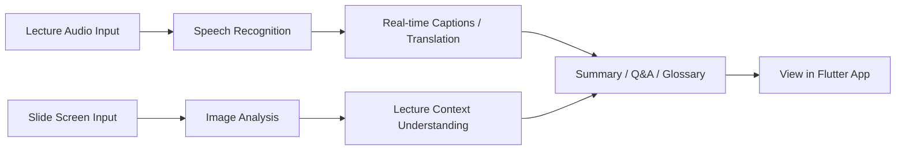

<p align="center">
  
</p>

<p align="center">
  <a href="#-getting-started">
    
  </a>
  <a href="#-demo-example">
    
  </a>
  <br/>
  
  
  
  
  
</p>

<p align="center">
  <b>Development of a Flutter-based real-time caption and question widget for lecture interaction</b>
</p>

<p align="center">
  <a href="../README.md">🇰🇷 한국어</a>
  ·
  <b>🇺🇸 English</b>
  ·
  <a href="README_jp.md">🇯🇵 日本語</a>
</p>

> [!NOTE]
> 🎓 **Department of AI, Dong-A University**
> SW-Centered University Project, Field-Mirror-Type Linked Project

> [!TIP]
> If you are new to this project, we recommend reading in this order:
> [Problems We Solve](#-problems-we-solve) → [Key Features](#-key-features) → [Demo Example](#-demo-example)

<br/>

### 📌 Project Overview

**Lecture Hunter** is an AI-powered learning assistant that helps students better understand and review real-time lectures.

It analyzes lecture audio, slide screens, and student questions together to provide the following features:

* Convert the professor’s voice into real-time captions
* Translate foreign-language lectures into Korean
* Analyze charts, formulas, and figures inside lecture slides
* Summarize key content when students miss the lecture flow
* Answer questions based on the lecture context
* Automatically generate a glossary of difficult terms

<br/>

### 📚 Table of Contents

* [Problems We Solve](#-problems-we-solve)
* [Key Features](#-key-features)
* [User Flow](#-user-flow)
* [Screen Layout](#-screen-layout)
* [Demo Example](#-demo-example)
* [Tech Stack](#-tech-stack)
* [Project Structure](#-project-structure)
* [Getting Started](#-getting-started)
* [Development Commands](#-development-commands)
* [Current Frontend Integration Status](#-current-frontend-integration-status)
* [Progress](#-progress)

<br/>

### 🤔 Problems We Solve

> *"This lecture is in English, and once I miss one word, I lose track of everything after that..."*

> *"There was a term I didn’t understand during class, but I felt uncomfortable raising my hand to ask..."*

> *"I joined the class 10 minutes late, and I have no idea what the lecture is about right now..."*

> *"Rewatching an entire one-hour lecture just to review is too time-consuming..."*

**Lecture Hunter helps students understand, ask questions, summarize, and review lectures in one integrated screen.**

<br/>

### ✨ Key Features

| Feature                  | Description                                                                       |
| ------------------------ | --------------------------------------------------------------------------------- |
| 🎙 Real-time Captions    | Converts lecture audio into text and displays it on the screen.                   |
| 🌐 Real-time Translation | Translates foreign-language lectures into Korean in real time.                    |
| 🖼 Slide Analysis        | Analyzes charts, formulas, and figures in slides to understand lecture context.   |
| 💬 In-lecture Q&A        | Answers student questions based on the lecture content so far.                    |
| 📝 Key Summaries         | Summarizes lecture content every 5–10 minutes so students can quickly catch up.   |
| 📚 Automatic Glossary    | Automatically organizes difficult concepts and keywords that appear during class. |

<br/>

### 🔄 User Flow



> If Mermaid diagrams are not displayed in your GitHub environment, you can understand the flow as follows:
>
> **Lecture Input → Audio & Slide Analysis → Caption & Translation Generation → Summary, Q&A, and Glossary → View in App**

<br/>

### 🖼 Demo Host-based Widget Screen Layout

<p align="center">
  <table>
    <tr>
      <th align="center">Caption Overlay</th>
      <th align="center">Glossary Widget</th>
      <th align="center">Lecture AI Question Panel</th>
    </tr>
    <tr>
      <td align="center">
        
      </td>
      <td align="center">
        
      </td>
      <td align="center">
        
      </td>
    </tr>
    <tr>
      <th align="center">Caption Settings</th>
      <th align="center">Caption History</th>
      <th align="center">-</th>
    </tr>
    <tr>
      <td align="center">
        
      </td>
      <td align="center">
        
      </td>
      <td align="center">-</td>
    </tr>
  </table>
</p>

<br/>

### 💡 Demo Example

**Scenario: A machine learning lecture conducted in English**

```text
🎤 Professor
"Now let's discuss the vanishing gradient problem..."

📺 Caption Screen
Original: Now let's discuss the vanishing gradient problem...
Translation: Now let's discuss the vanishing gradient problem...

💬 Student Question
"Why is the vanishing gradient problem an issue?"

🤖 AI Answer
"As shown in the graph on slide 7,
the learning signal becomes harder to pass back to earlier layers
as a neural network becomes deeper.
This makes training difficult.
It is related to the backpropagation process explained around minute 15 of the lecture."
```

<br/>

### 🛠 Tech Stack

### 📱 Frontend

| Technology      | Role                                                            |
| --------------- | --------------------------------------------------------------- |
| Flutter 3.x     | Development of a web-based real-time caption overlay UI         |
| Dart            | Programming language for Flutter app development                |
| Riverpod        | State management for captions, themes, and question panels      |
| HTTP API        | Preparation for connecting question, glossary, and summary APIs |
| SSE / WebSocket | Preparation for real-time caption streaming and audio streaming |

<br/>

### ⚙️ Backend

| Technology       | Role                                      |
| ---------------- | ----------------------------------------- |
| Python 3.12      | Backend development language              |
| FastAPI          | API server implementation                 |
| Faster-Whisper   | Speech recognition and caption generation |
| Llama 3.2 Vision | Slide image analysis                      |
| Gemma 2          | Multilingual translation                  |
| Silero VAD       | Voice activity detection                  |

<br/>

### 🗄 Database / Infra

| Technology | Role                                              |
| ---------- | ------------------------------------------------- |
| Supabase   | Authentication, data storage, and API integration |
| PostgreSQL | Lecture data storage                              |
| pgvector   | Vector search for lecture content                 |
| Ollama     | Local LLM runtime                                 |

<br/>

### 📁 Project Structure

```text
Lecture-Hunter
│
├── 📂 App/                     # FastAPI backend
│   ├── main.py
│   ├── api/
│   ├── core/
│   ├── services/
│   ├── setup_db.sql
│   └── ...
│
├── 📂 Frontend/                # Flutter application
│   ├── android/
│   ├── ios/
│   ├── lib/
│   │   ├── core/
│   │   ├── features/
│   │   │   ├── assistant/
│   │   │   ├── caption/
│   │   │   └── overlay/
│   │   ├── services/
│   │   ├── shared/
│   │   └── main.dart
│   ├── web/
│   ├── macos/
│   ├── windows/
│   ├── linux/
│   ├── pubspec.yaml
│   └── analysis_options.yaml
│
├── 📂 assets/
│   └── LectureHunter_Logo3.jpeg
│
├── 📄 README.md
├── 📄 README.en.md
├── 📄 README.zh.md
├── 📄 CONTRIBUTING.md
├── 📄 CODE_OF_CONDUCT.md
├── 📄 SECURITY.md
├── 📄 LICENSE
├── 📄 Dockerfile
└── 📄 requirements.txt
```

<br/>

### 🚀 Getting Started

### 1. Requirements

| Item    | Recommended Version / Condition                         |
| ------- | ------------------------------------------------------- |
| OS      | macOS Apple Silicon or a PC with NVIDIA GPU recommended |
| Python  | 3.12                                                    |
| Flutter | 3.x                                                     |
| Memory  | 16GB or higher recommended                              |
| Others  | Ollama, Supabase project                                |

<br/>

### 2. Clone the Project

```bash
git clone https://github.com/2022764025/Lecture-Hunter.git
cd Lecture-Hunter
```

<br/>

### 3. Set Up the Backend Environment

```bash
python3 -m venv pikmin
source pikmin/bin/activate
pip install -r requirements.txt
```

<br/>

### 4. Set Environment Variables

```bash
cp .env.example .env
```

Open the `.env` file and enter your Supabase and local AI server information.

```env
SUPABASE_URL=your_supabase_url
SUPABASE_ANON_KEY=your_supabase_anon_key
LLM_MODEL=gemma2:2b
VLM_MODEL=llama3.2-vision:11b
WHISPER_MODEL_SIZE=medium
WHISPER_DEVICE=auto
VAD_THRESHOLD=0.3
```

<br/>

### 5. Set Up the Flutter App

```bash
cd Frontend
flutter pub get
flutter doctor
cd ..
```

<br/>

### 6. Run the Project

We recommend using three separate terminal windows.

### Terminal 1. Run the Local AI Server

```bash
ollama serve
```

### Terminal 2. Run the Backend Server

```bash
source pikmin/bin/activate
uvicorn App.main:app --reload
```

### Terminal 3. Run the Flutter App

```bash
cd Frontend
flutter run -d chrome
```

<br/>

### 7. Check the Execution Status

Once the project is running successfully, check the following:

* Backend server is running at `http://127.0.0.1:8000`
* Flutter app is running in Chrome
* LiveLectureAI screen is displayed correctly
* Caption overlay, question panel, and glossary UI are displayed
* Current frontend has completed mock-based UI behavior verification
* Actual backend integration will proceed after API path alignment

<br/>

### 🧪 Development Commands

### Flutter

```bash
cd Frontend

# Install packages
flutter pub get

# Format code
dart format .

# Static analysis
flutter analyze

# Run app
flutter run -d chrome
```

<br/>

### Backend

```bash
# Activate virtual environment
source pikmin/bin/activate

# Run server
uvicorn App.main:app --reload

# Reinstall packages
pip install -r requirements.txt
```

<br/>

### 🔌 Current Frontend Integration Status

The frontend has currently completed mock-based UI behavior verification and is in the stage of aligning API paths with the actual backend endpoints.

### Verified Items

* Checked backend HTTP call structure in `api_service.dart`
* Checked real-time caption stream receiving structure in `sse_service.dart`
* Checked Provider connection structure in `caption_controller.dart`
* Checked mock / real server switching structure in `overlay_page.dart`
* Checked actual backend endpoint list

### Current Frontend Connection Structure

* HTTP API call structure based on `ApiService`
* Real-time caption stream receiving structure based on `SseService`
* `sseServiceProvider` registered
* `connectionStatusProvider` connected
* `subtitleStreamProvider` connected
* Latest caption display structure based on `currentSubtitleProvider`
* Mock mode / real server connection switching structure available

### Confirmed Path Mismatches

| Category                    | Current Frontend Path         | Current Backend Path           |
| --------------------------- | ----------------------------- | ------------------------------ |
| Question API                | `POST /api/v1/qa/ask`         | `GET /lecture/ask`             |
| Glossary API                | `GET /api/v1/glossary/search` | Backend endpoint not confirmed |
| Real-time caption receiving | `GET /api/v1/subtitle/stream` | `WS /ws/audio/{lecture_id}`    |

### Planned Fixes

* Modify question API path in `api_service.dart`
* Check request method and parameter structure for `/lecture/ask`
* Check whether to add a backend endpoint for the glossary API
* Decide whether to keep `sse_service.dart`
* Match backend WebSocket structure with frontend real-time caption receiving structure

<br/>

### 📊 Progress

### ✅ Completed Features

* [x] Backend structure for speech-to-caption conversion
* [x] Backend structure for slide image analysis
* [x] Backend structure for AI answers based on lecture content
* [x] FastAPI WebSocket audio receiving structure
* [x] Multilingual translation engine integration structure
* [x] Flutter real-time caption UI structure
* [x] Flutter mock caption stream structure
* [x] Flutter API/SSE service layer structure
* [x] Flutter feature-based folder structure organization
* [x] Flutter main UI button behavior verification
* [x] Confirmed Flutter analyze with no issues found

<br/>

### 🚧 Features in Progress

* [ ] Align actual STT/API/SSE connection paths
* [ ] Connect question API `/lecture/ask` to the frontend
* [ ] Add glossary API endpoint or modify frontend path
* [ ] Decide real-time caption receiving method: keep SSE or switch to WebSocket
* [ ] Finalize Flutter app UI
* [ ] Automatic lecture summary feature
* [ ] Multi-user concurrent access stability test
* [ ] Learning engagement analysis dashboard

<br/>

### 🗓 Planned Features

* [ ] Lecture-specific history storage
* [ ] Caption search
* [ ] Bookmark feature
* [ ] User settings screen
* [ ] Review summary report for lectures
* [ ] Review iframe structure for applying to external sites
* [ ] Review Chrome Extension-based overlay structure
