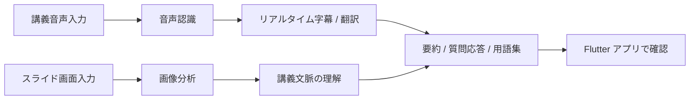

<p align="center">
  
</p>

<p align="center">
  <a href="#-はじめに">
    
  </a>
  <a href="#-利用例">
    
  </a>
  <br/>
  
  
  
  
  
</p>

<p align="center">
  <b>講義インタラクションのための Flutter ベース リアルタイム字幕・質問ウィジェット開発</b>
</p>

<p align="center">
  <a href="../README.md">🇰🇷 한국어</a>
  ·
  <a href="README_en.md">🇺🇸 English</a>
  ·
  <a href="README_zh.md">🇨🇳 中文</a>
  ·
  <b>🇯🇵 日本語</b>
</p>

> [!NOTE]
> 🎓 **東亜大学 AI 学科**
> SW 中心大学事業 現場ミラー型連携プロジェクト

> [!TIP]
> 初めてこのプロジェクトを見る方は、
> [解決したい課題](#-解決したい課題) → [主な機能](#-主な機能) → [利用例](#-利用例)
> の順に読むと、素早く理解できます。

<br/>

### 📌 プロジェクト概要

**Lecture Hunter** は、リアルタイム講義をより簡単に理解し、復習できるように支援する AI ベースの学習アシスタントです。

講義中に発生する音声、スライド画面、質問内容を総合的に分析し、以下の機能を提供します。

* 教授の音声をリアルタイム字幕に変換
* 外国語講義を韓国語に翻訳
* スライド内の図表、数式、画像を分析
* 講義の流れを見失ったときに重要内容を要約
* 講義の文脈を反映した AI 質問応答
* 難しい用語を自動で整理する用語集を提供

<br/>

### 📚 目次

* [解決したい課題](#-解決したい課題)
* [主な機能](#-主な機能)
* [利用フロー](#-利用フロー)
* [画面構成](#-画面構成)
* [利用例](#-利用例)
* [技術スタック](#-技術スタック)
* [プロジェクト構成](#-プロジェクト構成)
* [はじめに](#-はじめに)
* [開発コマンド](#-開発コマンド)
* [現在のフロントエンド接続状態](#-現在のフロントエンド接続状態)
* [進行状況](#-進行状況)

<br/>

### 🤔 解決したい課題

> *「英語の講義で一単語を聞き逃しただけなのに、その後の内容が全然わからなくなった……」*

> *「授業中に知らない用語が出てきたけど、手を挙げて質問するのは少し負担……」*

> *「10分遅れて参加したら、今どこを説明しているのかわからない……」*

> *「復習のために1時間の講義を最初から見直すのは長すぎる……」*

**Lecture Hunter は、講義理解、質問、要約、復習をひとつの画面で支援する学習補助ツールです。**

<br/>

### ✨ 主な機能

| 機能          | 説明                                   |
| ----------- | ------------------------------------ |
| 🎙 リアルタイム字幕 | 講義音声をテキストに変換し、画面に表示します。              |
| 🌐 リアルタイム翻訳 | 外国語講義を韓国語に翻訳して表示します。                 |
| 🖼 スライド分析   | スライド内の図表、数式、画像を分析し、講義の文脈を把握します。      |
| 💬 講義中の質問   | ユーザーが質問すると、それまでの講義内容に基づいて AI が回答します。 |
| 📝 重要内容の要約  | 5〜10分単位で講義内容を要約し、流れを素早く追えるようにします。    |
| 📚 自動用語集    | 授業中に登場した難しい概念やキーワードを自動で整理します。        |

<br/>

### 🔄 利用フロー



> GitHub 環境で Mermaid が表示されない場合は、以下の流れとして理解できます。
>
> **講義入力 → 音声・スライド分析 → 字幕・翻訳生成 → 要約・質問応答・用語集提供 → アプリで確認**

<br/>

### 🖼 デモホストベースのウィジェット画面構成

<p align="center">
  <table>
    <tr>
      <th align="center">字幕オーバーレイ</th>
      <th align="center">用語集ウィジェット</th>
      <th align="center">講義 AI 質問パネル</th>
    </tr>
    <tr>
      <td align="center">
        
      </td>
      <td align="center">
        
      </td>
      <td align="center">
        
      </td>
    </tr>
    <tr>
      <th align="center">字幕設定</th>
      <th align="center">字幕履歴</th>
      <th align="center">-</th>
    </tr>
    <tr>
      <td align="center">
        
      </td>
      <td align="center">
        
      </td>
      <td align="center">-</td>
    </tr>
  </table>
</p>

<br/>

### 💡 利用例

**状況：英語で行われる機械学習の講義**

```text
🎤 教授
"Now let's discuss the vanishing gradient problem..."

📺 字幕画面
原文: Now let's discuss the vanishing gradient problem...
翻訳: それでは、勾配消失問題について説明します。

💬 学生の質問
「勾配消失はなぜ問題なのですか？」

🤖 AI 回答
「現在表示されているスライド7のグラフのように、
ニューラルネットワークが深くなるほど、
学習信号が前方の層まで伝わりにくくなります。
そのため、モデルの学習が難しくなります。
これは講義15分あたりで説明された誤差逆伝播の過程と関連しています。」
```

<br/>

### 🛠 技術スタック

### 📱 Frontend

| 技術              | 役割                           |
| --------------- | ---------------------------- |
| Flutter 3.x     | Web ベースのリアルタイム字幕オーバーレイ UI 開発 |
| Dart            | Flutter アプリ開発言語              |
| Riverpod        | 字幕、テーマ、質問パネルの状態管理            |
| HTTP API        | 質問、用語集、要約 API 連携準備           |
| SSE / WebSocket | リアルタイム字幕受信および音声ストリーミング連携準備   |

<br/>

### ⚙️ Backend

| 技術               | 役割          |
| ---------------- | ----------- |
| Python 3.12      | バックエンド開発言語  |
| FastAPI          | API サーバー構築  |
| Faster-Whisper   | 音声認識および字幕生成 |
| Llama 3.2 Vision | スライド画像分析    |
| Gemma 2          | 多言語翻訳       |
| Silero VAD       | 音声区間検出      |

<br/>

### 🗄 Database / Infra

| 技術         | 役割              |
| ---------- | --------------- |
| Supabase   | 認証、データ保存、API 連携 |
| PostgreSQL | 講義データ保存         |
| pgvector   | 講義内容のベクトル検索     |
| Ollama     | ローカル LLM 実行環境   |

<br/>

### 📁 プロジェクト構成

```text
Lecture-Hunter
│
├── 📂 App/                     # FastAPI backend
│   ├── main.py
│   ├── api/
│   ├── core/
│   ├── services/
│   ├── setup_db.sql
│   └── ...
│
├── 📂 Frontend/                # Flutter application
│   ├── android/
│   ├── ios/
│   ├── lib/
│   │   ├── core/
│   │   ├── features/
│   │   │   ├── assistant/
│   │   │   ├── caption/
│   │   │   └── overlay/
│   │   ├── services/
│   │   ├── shared/
│   │   └── main.dart
│   ├── web/
│   ├── macos/
│   ├── windows/
│   ├── linux/
│   ├── pubspec.yaml
│   └── analysis_options.yaml
│
├── 📂 assets/
│   └── LectureHunter_Logo3.jpeg
│
├── 📄 README.md
├── 📄 README_en.md
├── 📄 README_zh.md
├── 📄 README_jp.md
├── 📄 CONTRIBUTING.md
├── 📄 CODE_OF_CONDUCT.md
├── 📄 SECURITY.md
├── 📄 LICENSE
├── 📄 Dockerfile
└── 📄 requirements.txt
```

<br/>

### 🚀 はじめに

### 1. 必要な環境

| 項目      | 推奨バージョン / 条件                                |
| ------- | ------------------------------------------- |
| OS      | macOS Apple Silicon または NVIDIA GPU 搭載 PC 推奨 |
| Python  | 3.12                                        |
| Flutter | 3.x                                         |
| Memory  | 16GB 以上推奨                                   |
| その他     | Ollama、Supabase プロジェクト                      |

<br/>

### 2. プロジェクトをクローン

```bash
git clone https://github.com/2022764025/Lecture-Hunter.git
cd Lecture-Hunter
```

<br/>

### 3. バックエンド環境設定

```bash
python3 -m venv pikmin
source pikmin/bin/activate
pip install -r requirements.txt
```

<br/>

### 4. 環境変数設定

```bash
cp .env.example .env
```

`.env` ファイルを開き、Supabase およびローカル AI サーバー情報を入力します。

```env
SUPABASE_URL=your_supabase_url
SUPABASE_ANON_KEY=your_supabase_anon_key
LLM_MODEL=gemma2:2b
VLM_MODEL=llama3.2-vision:11b
WHISPER_MODEL_SIZE=medium
WHISPER_DEVICE=auto
VAD_THRESHOLD=0.3
```

<br/>

### 5. Flutter アプリ設定

```bash
cd Frontend
flutter pub get
flutter doctor
cd ..
```

<br/>

### 6. 実行方法

ターミナルを3つに分けて実行することを推奨します。

### Terminal 1. ローカル AI サーバー実行

```bash
ollama serve
```

### Terminal 2. バックエンドサーバー実行

```bash
source pikmin/bin/activate
uvicorn App.main:app --reload
```

### Terminal 3. Flutter アプリ実行

```bash
cd Frontend
flutter run -d chrome
```

<br/>

### 7. 実行確認

正常に実行されたら、以下の項目を確認します。

* バックエンドサーバーが `http://127.0.0.1:8000` で実行されているか確認
* Flutter アプリが Chrome で実行されているか確認
* LiveLectureAI 画面が正常に表示されているか確認
* 字幕オーバーレイ、質問パネル、用語集 UI が表示されているか確認
* 現在のフロントエンドは Mock ベースの UI 動作確認完了状態
* 実際のバックエンド連携は API パス整合性修正後に進行予定

<br/>

### 🧪 開発コマンド

### Flutter

```bash
cd Frontend

# パッケージインストール
flutter pub get

# コードフォーマット
dart format .

# 静的解析
flutter analyze

# アプリ実行
flutter run -d chrome
```

<br/>

### Backend

```bash
# 仮想環境有効化
source pikmin/bin/activate

# サーバー実行
uvicorn App.main:app --reload

# パッケージ再インストール
pip install -r requirements.txt
```

<br/>

### 🔌 現在のフロントエンド接続状態

現在のフロントエンドは Mock ベースの UI 動作確認まで完了しており、実際のバックエンドエンドポイントとの API パス整合性を修正する段階です。

### 確認済み項目

* `api_service.dart` のバックエンド HTTP 呼び出し構造確認
* `sse_service.dart` のリアルタイム字幕ストリーム受信構造確認
* `caption_controller.dart` の Provider 接続構造確認
* `overlay_page.dart` の Mock / 実サーバー切り替え構造確認
* 実際のバックエンドエンドポイント一覧確認

### 現在のフロントエンド接続構造

* `ApiService` ベースの HTTP API 呼び出し構造
* `SseService` ベースのリアルタイム字幕ストリーム受信構造
* `sseServiceProvider` 登録完了
* `connectionStatusProvider` 接続完了
* `subtitleStreamProvider` 接続完了
* `currentSubtitleProvider` ベースの最新字幕表示構造
* Mock モード / 実サーバー接続切り替え構造

### 確認されたパス不一致

| 区分         | 現在のフロントエンドパス                  | 現在のバックエンドパス                 |
| ---------- | ----------------------------- | --------------------------- |
| 質問 API     | `POST /api/v1/qa/ask`         | `GET /lecture/ask`          |
| 用語集 API    | `GET /api/v1/glossary/search` | バックエンドエンドポイント未確認            |
| リアルタイム字幕受信 | `GET /api/v1/subtitle/stream` | `WS /ws/audio/{lecture_id}` |

### 次の修正予定

* `api_service.dart` の質問 API パス修正
* `/lecture/ask` のリクエスト方式およびパラメータ構造確認
* 用語集 API バックエンドエンドポイント追加 여부 확인
* `sse_service.dart` 維持 여부 결정
* バックエンド WebSocket 構造とフロントエンドのリアルタイム字幕受信構造を一致

<br/>

### 📊 進行状況

### ✅ 完了した機能

* [x] 音声 → 字幕変換バックエンド構造
* [x] スライド画像分析バックエンド構造
* [x] 講義内容ベースの AI 回答バックエンド構造
* [x] FastAPI WebSocket 音声受信構造
* [x] 多言語翻訳エンジン連携構造
* [x] Flutter リアルタイム字幕 UI 構造
* [x] Flutter Mock 字幕ストリーム構造
* [x] Flutter API/SSE サービス層構造
* [x] Flutter feature-based フォルダ構成整理
* [x] Flutter 主要 UI ボタン動作確認
* [x] Flutter analyze No issues found 確認

<br/>

### 🚧 作業中の機能

* [ ] STT/API/SSE 実接続パス整合性修正
* [ ] 質問 API `/lecture/ask` フロントエンド連携
* [ ] 用語集 API エンドポイント追加またはフロントエンドパス修正
* [ ] リアルタイム字幕受信方式決定：SSE 維持または WebSocket 構造へ切り替え
* [ ] Flutter アプリ UI 仕上げ
* [ ] 自動講義要約機能
* [ ] 複数ユーザー同時接続安定性テスト
* [ ] 学習参加度分析ダッシュボード

<br/>

### 🗓 追加予定機能

* [ ] 講義別履歴保存
* [ ] 字幕検索
* [ ] ブックマーク機能
* [ ] ユーザー設定画面
* [ ] 講義復習用要約レポート
* [ ] 外部サイト適用のための iframe 構造検討
* [ ] Chrome Extension ベースのオーバーレイ適用構造検討
