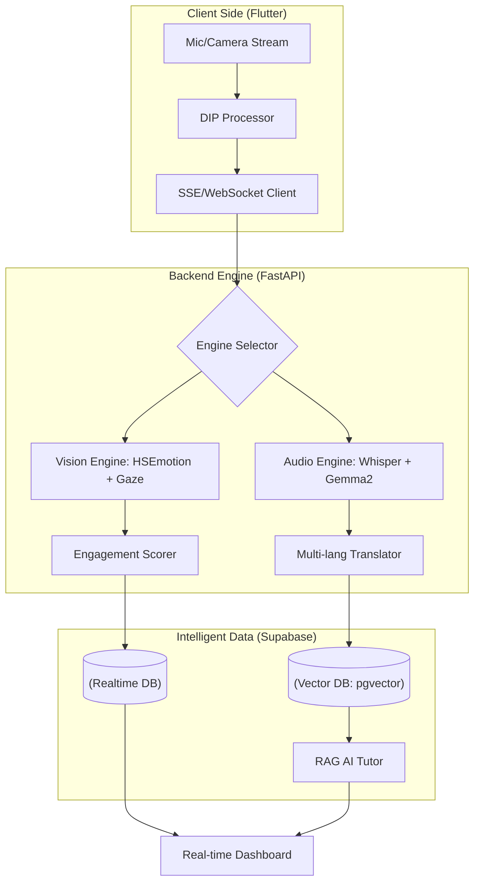

# 🎙️ LiveLectureAI
> **실증적AI 개발프로젝트Ⅰ** > **과제헌터** | 강의 상호작용을 위한 Flutter 기반 실시간 자막·질문 위젯 개발

[](https://www.python.org/) [](https://fastapi.tiangolo.com/) [](https://flutter.dev/) [](https://pytorch.org/) [](https://www.tensorflow.org/) [](https://developers.google.com/mediapipe) [](https://github.com/openai/whisper) [](https://supabase.com/) [](https://www.postgresql.org/) [](https://developer.mozilla.org/en-US/docs/Web/API/WebSockets_API) [](https://opensource.org/licenses/MIT) [](https://dora.dev/) [](https://github.com/features/actions)

<p align="center">
    <a href="README.md">
        
    </a>
    <a href="README.en.md">
        
    </a>
    <a href="README.zh.md">
        
    </a>
</p>

---

## 📄 Project Overview

### "A Flutter-based Real-time Captioning and Inquiry Widget for Enhanced Lecture Interaction"

This project aims to develop an AI-driven educational platform that utilizes multimodal analysis of instructors' lectures (audio/visuals) and students' reactions (emotions/gaze) to minimize the physical gap and optimize learning outcomes in real time.

본 프로젝트는 강의자의 멀티모달 데이터(음성/시각)와 학생의 실시간 반응(감정/시선)을 분석하여, 비대면/대면 강의의 물리적 간극을 줄이고 학습 성과를 최적화하는 AI 기반 교육 플랫폼입니다.

---

## 🚀 Key Features (4 Pillars) ##

**📊 [실시간] 익명 집계 대시보드**

- **익명성 보장**: 개별 학생의 데이터를 삭제하고 학급 전체의 평균 집중도만 추출.

- **교수자 피드백**: "현재 70%가 어려워함" 메시지를 통해 수업 속도 즉각 조절.

**🗺️ [수업 후] 강의 자료 시선 히트맵**

- **Gaze Tracking** : 학생들의 시선이 슬라이드 좌표($x, y$) 중 어디에 머물렀는지 시각화.

- **콘텐츠 최적화** : 학습자가 방황한 지점을 파악하여 강의 자료 보완 근거 제공.

**⏱️ [복습용] 스마트 복습 타임라인**

- **EAR & 시선 이탈** : 졸았거나 고개를 돌린 시간대를 영상 타임라인에 자동 마킹.

- **핀포인트 복습** : 3시간 강의를 다 볼 필요 없이 놓친 구간만 효율적 복습 가능.

**📈 [B2B] 강사 성과 지표 및 콘텐츠 품질 관리 (QC)**

- **Instructor Score (성과 수치화)** : 강의 참여도의 평균값과 **변동성(표준편차)**을 결합한 독자적 알고리즘으로 강사의 강의력을 정량적 점수로 산출.

- **데이터 컨설팅** : 강사별 이탈 지점 분석을 통해 콘텐츠 재촬영 구간 결정 및 강사 재계약을 위한 객관적 의사결정 근거 제공.

- **품질 최적화** : 스타 강사 발굴 및 교육 콘텐츠 품질 상향 평준화를 위한 고부가가치 비즈니스 인사이트 도출.

---

## 🧠 Technical Deep Dive: Advanced Engineering ##

### 1. Whisper VAD & STT Optimization ###

무음 구간에서의 환각 현상(Hallucination)을 방지하기 위한 **VAD (Voice Activity Detection)** 로직입니다.

**A. Signal Energy-based VAD**

입력 신호 $x(n)$의 프레임 에너지가 배경 소음 에너지($E_{noise}$)보다 충분히 클 때만 STT 엔진을 구동합니다.

$$E_{frame} = \sum_{n=1}^L |x(n)|^2 > \gamma \cdot E_{noise}$$

- $\gamma$: 신호 대 잡음비(SNR)를 고려한 동적 임계치

### 2. RAG Optimization: Vector Normalization ###

대규모 강의 데이터셋에서 검색 속도와 정확도를 보장하기 위해 L2 Normalization을 거친 내적 연산을 수행합니다.

$$\|\mathbf{v}\|_2 = \sqrt{\sum_{i=1}^n |v_i|^2}, \quad \mathbf{\hat{v}} = \frac{\mathbf{v}}{\|\mathbf{v}\|_2}$$

- 정규화된 벡터 간의 내적은 코사인 유사도와 동일하므로, 연산 복잡도를 줄이면서 실시간 검색 성능을 극대화합니다.

### 3. DIP (Digital Image Processing) Preprocessing ###

비전 엔진의 정확도를 높이기 위해 입력 영상에 DoG (Difference of Gaussians) 필터를 적용하여 노이즈를 제거하고 특징점을 부각합니다.

**A. Difference of Gaussians (DoG)**

서로 다른 표준편차($\sigma_1, \sigma_2$)를 가진 두 가우시안 커널의 차를 이용하여 엣지를 강조합니다.

$$DoG(x, y) = \frac{1}{2\pi\sigma_1^2} e^{-\frac{x^2+y^2}{2\sigma_1^2}} - \frac{1}{2\pi\sigma_2^2} e^{-\frac{x^2+y^2}{2\sigma_2^2}}$$

-> 이 과정을 통해 조명 변화에 강건한(Robust) 랜드마크 추출이 가능해집니다.

**B. Sobel Edge Detection**

시선 추적의 정밀도를 높이기 위해 동공 영역의 경계선을 검출합니다.

$$G = \sqrt{G_x^2 + G_y^2}, \quad \theta = \arctan\left(\frac{G_y}{G_x}\right)$$

### 4. Multi-modal Engagement Fusion Model ###

단일 지표의 한계를 극복하기 위해 비전($V$)과 감정($A$) 데이터를 결합한 융합 집중도 지표를 사용합니다.

**A. Composite Engagement Score ($CE$)**

$$CE = w_e \cdot EAR_{norm} + w_g \cdot Gaze_{dist} + w_{emo} \cdot \sum (Emo_i \cdot s_i)$$

- $w_e, w_g, w_{emo}$: 각 지표의 중요도에 따른 가중치 ($\sum w = 1$)

- $s_i$: 각 감정(Emotion)별 집중도 상관계수 (예: Neutral=1.0, Surprise=0.8, Sad=-0.5)

**B. Head Pose Variance ($HP_v$)**

고개의 흔들림(Yaw, Pitch, Roll)을 통해 비집중 구간을 감지합니다.

$$HP_v = \sqrt{\frac{1}{N}\sum_{i=1}^N (\theta_i - \bar{\theta})^2}$$

- 표준편차가 임계치를 넘으면 'Distracted' 상태로 분류하여 대시보드에 반영합니다.

---

## 🏗️ System Architecture

본 프로젝트 시스템은 "**실시간 엣지 분석 -> 클라우드 지능형 처리 -> 다국어 브로드캐스트**"의 3단계 파이프라인으로 작동합니다.



---

## 📂 Data Schema & Architecture

| Table Name | Key Columns | Description |
| :--- | :--- | :--- |
| **lecture_contents** | `original`, `translated`, `target_lang`, `embedding` | 실시간 자막 전사 및 번역 데이터, 벡터 검색용 임베딩 |
| **lecture_logs** | `engagement_score`, `emotion`, `gaze_x/y`, `ear` | 시선 추적, 감정 분석, 졸음 감지 원천 데이터 |
| **lecture_summaries** | `summary_text`, `key_points` | 강의 종료 후 생성되는 AI 요약 및 키워드 데이터 |

---

## 🛠 Tech Stack & Environment ##

### 💻 Development Environment

- OS: macOS (Apple Silicon M1/M2/M3)

- Language: Python `3.12+` (**Python 3.13+ is not supported**)

- Framework: FastAPI (Asynchronous Backend)

- Virtual Env: venv ('pikmin')

### 🧠 AI & Machine Learning (Core)

- 🎙 STT (Speech-to-Text): **faster-whisper** `(1.2.1)`

- 👁 Computer Vision: 

    - **mediapipe** `(0.10.13)`
    
    - **hsemotion-onnx** `(0.3.1)`

- 🏗 Deep Learning Framework:

    - **tensorflow-macos** `(2.16.1)` / **keras** `(3.13.2)`
    
    - **torch** `(2.10.0)` / **torchvision** `(0.25.0)`

    - **jax** `(0.4.26)`

- 🤖 LLM / RAG:

    - **ollama** `(0.6.1)`
    
    - **ctranslate2** `(4.7.1)`

- 🧮 Mathematical Tools:

    - **numpy** `(1.26.4)`
    
    - **scipy** `(1.17.1)`
    
    - **sympy** `(1.14.0)`
      
### 🌐 Backend & Communication

- ⚡ API Server:

    - **fastapi** `(0.135.1)` (비동기 API 서버)
    
    - **uvicorn** `(0.41.0)` (ASGI 서버)

- ☁️ Database / Auth: **supabase** `(2.28.0)` (Postgrest, Auth, Functions 연동)

- 🔌 Real-time Communication: 

    - **websockets** `(15.0.1)` (실시간 자막/질문 위젯 데이터 전송)

    - **sse-starlette**

- 🛰 Asynchronous Client:

    - **httpx** `(0.28.1)`
    
    - **anyio** `(4.12.1)`

### 🎙 Audio & Utilities

- 🎧 Audio Processing:

    - **sounddevice** `(0.5.5)`
    
    - **av** `(16.1.0)`

- 🛡 Data Validation: **pydantic v2** `(2.12.5)`

- 📝 Environment Config: **python-dotenv** `(1.2.2)`

---

## ✅ Project Milestone & Checklist (Updated 2026.04.09) ##

**1️⃣ Multi-modal AI Engine (Core)**

- [x] 비전 분석 엔진 고도화: `HSEmotion` + `DIP(Sobel, DoG)` 하이브리드 로직 구축

- [x] 시선 추적 안정화: EMA 필터 및 비선형 가속을 통한 Gaze Tracking 정확도 개선

- [x] 지능형 음성 인식(STT): Whisper(Medium) 기반 다국어 자동 판독(Auto-Detection) 로직 구현

- [x] 동적 다국어 번역 엔진: Gemma2 기반 사용자 선택형 목표 언어(Target Language) 번역 시스템 연동

- [x] VAD 음성 감지 통합: Whisper VAD 필터 적용으로 환각 현상 방지 및 무음 구간 처리 최적화

**2️⃣ Backend & Intelligence (Architecture)**

- [x] 백엔드 아키텍처 설계: FastAPI 기반 SSE 스트리밍 및 RAG 서비스 구조화 완료

- [x] 벡터 기반 RAG 엔진: Supabase Vector(pgvector)를 활용한 강의 내용 임베딩 및 유사도 검색 구축

- [x] 메모리 기반 지능형 Q&A: 이전 강의 문맥을 기억하고 답변하는 RAG 서비스 로직 완성

- [x] 데이터베이스 스키마 최적화: `target_lang` 컬럼 추가 및 다국어 데이터 저장 구조 확보

**3️⃣ High-Performance Scaling (Testing & Deployment)**

- [ ] vLLM 기반 고성능 모델 배포: Gemma2-9B/27B 모델 서빙을 위한 vLLM 엔진 교체 및 GPU 서버 테스트

- [ ] 하드웨어 가속 및 모델 업그레이드: Whisper Large-v3 및 CUDA 가속을 통한 실시간 성능 극대화 테스트

- [ ] 동시 접속자 대응 벤치마크: 다중 사용자 접속 시 처리 성능(Throughput) 및 지연 시간 측정

- [ ] 강의 분석 리포트 생성: 참여도 및 안정도 데이터를 활용한 자동 분석 리포트 생성 API 완성

**4️⃣ Frontend Integration (Flutter)**

- [ ] SSE 실시간 통신 연동: 백엔드 분석 데이터를 Flutter 클라이언트로 실시간 수신 및 가시화 테스트

- [ ] 실시간 다국어 자막 UI: 목표 언어 선택 위젯 및 스트리밍 자막 뷰어 UI 구현

- [ ] 집중도 대시보드 위젯: 실시간 참여도 그래프 및 시선 히트맵 시각화 위젯 개발

---

## ⚙️ Getting Started ##

**Installation**
```Bash
git clone https://github.com/2022764025/Lecture-Hunter.git
cd LiveLectureAI
python3 -m venv pikmin
source pikmin/bin/activate
pip install -r requirements.txt
```

**Usage**
```Bash
# FastAPI server start
uvicorn App.main:app --reload

# Vision Engine test(Local)
python3 services/test_vision.py
```

---

## 📄 License ##

**MIT License**