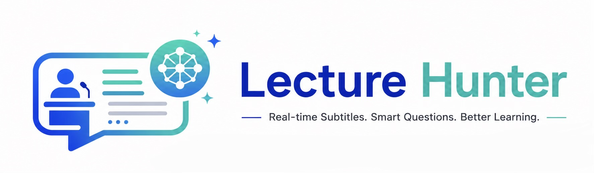
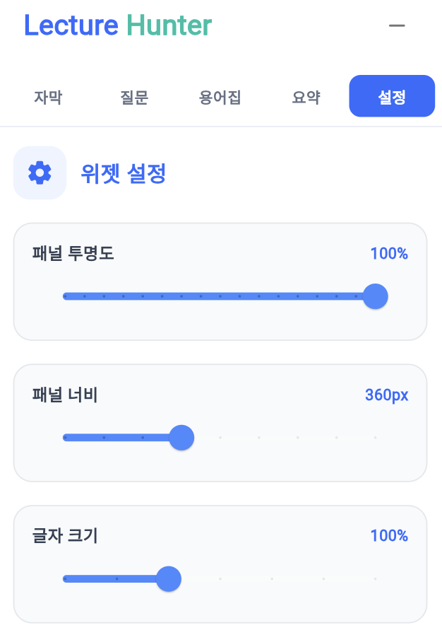
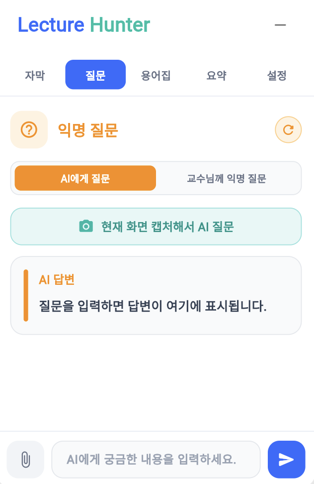
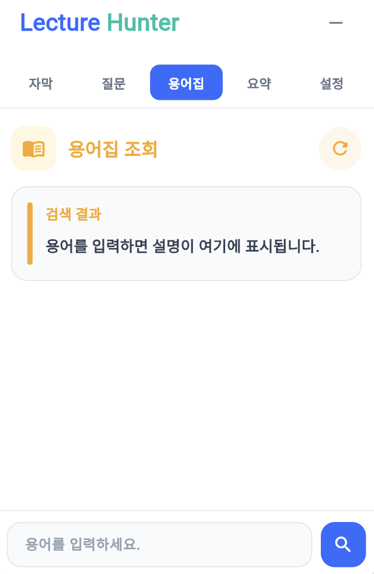
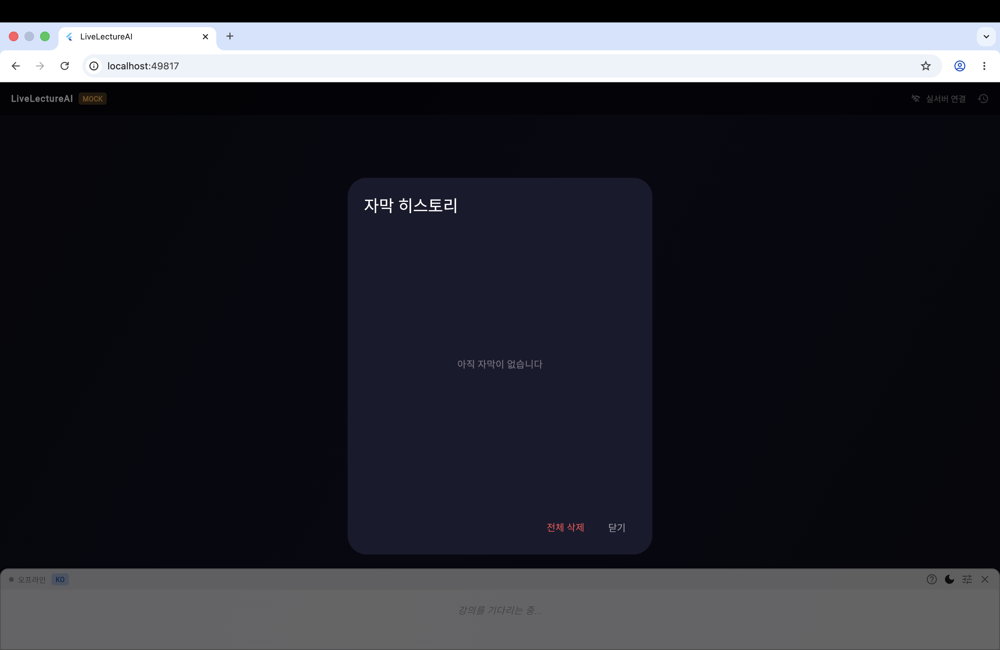
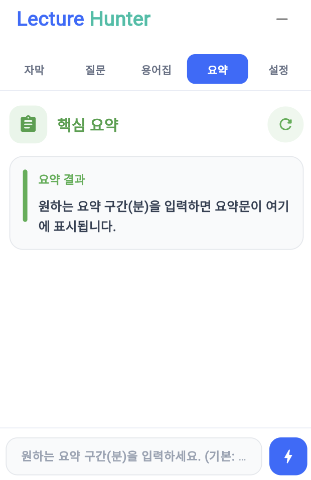

<p align="center">
  
</p>

<p align="center">
  <a href="#-시작하기">
    
  </a>
  <a href="#-사용-예시">
    
  </a>
  <br/>
  
  
  
  
  
</p>

<p align="center">
  <b>강의 상호작용을 위한 Flutter 기반 실시간 자막·질문 위젯 개발</b>
</p>

<p align="center">
  🇰🇷 한국어 &nbsp;·&nbsp;
  <a href="docs/README.en.md">🇺🇸 English</a> &nbsp;·&nbsp;
  <a href="docs/README.jp.md">🇯🇵 日本語</a> &nbsp;·&nbsp;
  <a href="docs/README.zh.md">🇨🇳 简体中文</a>
</p>

> [!NOTE]
> 동아대학교 AI학과 SW중심대학사업 현장미러형 연계 프로젝트
> 👩🏻‍🎓👨🏻‍🎓👨🏻‍🎓 **과제헌터 팀**

---

### 📺 이 프로젝트가 뭔가요?

TV에서 자막 보신 적 있으시죠?

**강의 화면 위에 실시간 자막이 뜨는 AI 프로그램이에요.**

교수님이 말씀하시는 순간, 바로 글자로 화면에 나타나요.
외국어 강의도 **한국어로 번역**해서 보여드리고,
모르는게 있다면 **검색**도 가능해요.
강의를 놓쳤다면 **"지금까지 뭐 했는지" 요약**도 해드려요.

> 💡 **TIP**
손 들고 질문하기 두려울 때 특히 유용해요. 아무도 모르게 AI한테만 물어볼 수 있거든요! 🙈

---

### 📚 목차

* [이런 상황에서 유용해요](#-이런-상황에서-유용해요)
* [주요 기능 미리보기](#-주요-기능-미리보기)
* [사용 예시](#-사용-예시)
* [어떻게 작동하나요?](#-어떻게-작동하나요)
* [시작하는 방법](#-시작하는-방법)
* [현재 개발 상황](#-현재-개발-상황)
* [어떻게 사용하나요?](#-어떻게-사용하나요)
* [어떤 기술로 만들었나요?](#-어떤-기술로-만들었나요)
* [프로젝트 구조](#-프로젝트-구조)
* [참고 자료](#참고-자료)

---

### 🙋 이런 상황에서 유용해요

| 이런 상황이라면...                  | 이렇게 도와줘요    |
| ---------------------------- | --------------------------- |
| “영어 강의라 하나도 못 알아듣겠어...”      | 한국어 번역 자막으로 이해를 도와줘요.       |
| “교수님이 너무 빠르게 말씀하셔...”        | 놓친 내용을 자막으로 다시 확인할 수 있어요.   |
| “10분 늦게 들어왔는데 지금 무슨 얘기야...”  | 강의 흐름을 AI 질문으로 확인할 수 있어요.   |
| “질문하고 싶은데 손들기 부끄러워...”       | AI에게 조용히 질문할 수 있어요.         |
| “어려운 단어가 나왔는데 다시 확인하고 싶어...” | 저장된 강의 용어를 검색해서 확인할 수 있어요.  |
| “지나간 자막을 다시 보고 싶어...”        | 자막 히스토리에서 이전 자막을 확인할 수 있어요. |

---

### 🖼 주요 기능 미리보기

<table align="center">
  <tr>
    <th align="center">🎙 실시간 자막 및 번역</th>
    <th align="center">⚙️ 설정</th>
  </tr>
  <tr>
    <td align="center">
      준비 중
      <br/>
      <sub>수신된 자막의 원문과 한국어 번역을 함께 볼 수 있어요.</sub>
    </td>
    <td align="center">
      <br/>
      <sub>자막 크기, 위치, 투명도, 테마를 조절할 수 있어요.</sub>
    </td>
  </tr>

  <tr>
    <th align="center">💬 강의 AI 질문</th>
    <th align="center">📚 용어집 조회</th>
  </tr>
  <tr>
    <td align="center">
      <br/>
      <sub>강의 내용을 바탕으로 AI에게 질문할 수 있어요.</sub>
    </td>
    <td align="center">
      <br/>
      <sub>저장된 강의 용어를 검색해서 확인할 수 있어요.</sub>
    </td>
  </tr>

  <tr>
    <th align="center">📜 지난 자막 보기</th>
    <th align="center">📝 핵심 요약</th>
  </tr>
  <tr>
    <td align="center">
      <br/>
      <sub>지나간 자막도 다시 확인할 수 있어요.</sub>
    </td>
    <td align="center">
      <br/>
      <sub>지나간 자막도 다시 확인할 수 있어요.</sub>
    </td>
      <sub>강의 내용을 짧게 요약해줘요.</sub>
    </td>
  </tr>
</table>

<br/>

---


### 💡 사용 예시

**상황: 영어로 진행되는 수업**

```text
교수님:
"Now let's discuss the vanishing gradient problem."

화면 자막:
원문: Now let's discuss the vanishing gradient problem.
번역: 이제 기울기 소실 문제에 대해 다뤄보겠습니다.

학생 질문:
"기울기 소실이 뭐예요?"

AI 답변:
기울기 소실은 신경망이 깊어질수록 학습 신호가 앞쪽까지 잘 전달되지 않아
학습이 어려워지는 현상입니다.
```

<br>


## 🔄 어떻게 작동하나요?

> **마이크로 교수님 목소리를 듣고 → AI가 글자로 바꾸고 → 내 화면에 보여준다**

조금 더 풀어보면 이래요:

```
1️⃣  교수님이 말씀하신다
        ↓
2️⃣  AI가 목소리를 듣고 글자로 바꾼다
   (영어면 한국어로도 자동 번역)
        ↓
3️⃣  내 화면에 자막으로 표시된다
        ↓
4️⃣  모르는 게 있으면?  → AI한테 질문!
    강의 흐름 놓쳤으면? → 요약 버튼 클릭!
```

<br/>


## 🚀 시작하는 방법


| 항목 | 버전 |
|------|------|
| Python | 3.12 |
| Flutter | 3.x |
| Ollama | 최신 버전 |
| Supabase 계정 | - |

**설치하기**

```bash
# 1. 프로젝트 가져오기
git clone https://github.com/2022764025/Lecture-Hunter.git
cd Lecture-Hunter

# 2. 백엔드 준비
python3 -m venv pikmin
source pikmin/bin/activate
pip install -r requirements.txt

# 3. 환경 설정 (.env 파일 생성 후 아래 내용 입력)
cp .env.example .env
```

```env
SUPABASE_URL=your_supabase_url
SUPABASE_ANON_KEY=your_supabase_anon_key
LLM_MODEL=gemma2:2b
VLM_MODEL=llama3.2-vision:11b
WHISPER_MODEL_SIZE=medium
WHISPER_DEVICE=auto
VAD_THRESHOLD=0.3
```

```bash
# 4. 화면(프론트엔드) 준비
cd Frontend
flutter pub get
cd ..
```

**실행하기 → 터미널 창을 3개 열어주세요**

```bash
# 터미널 1: AI 모델 서버 켜기
ollama serve

# 터미널 2: 백엔드 서버 켜기
cd ~/Downloads/Lecture-Hunter
source pikmin/bin/activate
cd App
uvicorn main:app --reload

# 터미널 3: 화면 실행
cd Frontend
flutter run -d chrome \
  --dart-define=API_BASE_URL=http://127.0.0.1:8000 \
  --dart-define=WS_BASE_URL=ws://127.0.0.1:8000 \
  --dart-define=SUPABASE_URL=your_supabase_url \
  --dart-define=SUPABASE_ANON_KEY=your_supabase_publishable_or_anon_key \
  --dart-define=LECTURE_ID=demo-lecture \
  --dart-define=TARGET_LANG=Korean
```

**잘 실행됐는지 확인하기**
- 주소창에 `http://127.0.0.1:8000` 열어서 응답이 오면 **OK**
- Chrome에서 자막 화면이 뜨면 **OK**
- 자막·질문·용어집 버튼들이 보이면 **OK**

<br>

---

## 📊 현재 개발 상황

| 기능 | 상태 |
|------|------|
| 질문 API 연동 | ✅ 완료 |
| 질문 히스토리 초기화 | ✅ 완료 |
| 용어집 API 연동 | ✅ 완료 |
| 실시간 자막 수신 | ✅ 완료 |
| 수동 자막 표시 테스트 | ✅ 완료 |
| 오디오 WebSocket 연결 | ✅ 완료 |
| 실제 마이크 음성 자막 변환 | ⏳ 예정 |
| 핵심 요약 기능 | 🔄 진행 중 |
| 슬라이드 이미지 분석 | 🔄 진행 중 |
| 여러 명 동시 사용 테스트 | ⏳ 예정 |


### 🧪 남은 핵심 작업

| 작업                 | 상태 |
| ------------------ | -- |
| 실제 마이크 입력          | 예정 |
| 마이크 음성 백엔드 전송      | 예정 |
| 음성 자막 변환           | 예정 |
| 변환된 자막 실시간 표시      | 예정 |
| 실제 음성 기반 전체 흐름 테스트 | 예정 |

---

## 🧭 어떻게 사용하나요?

Flutter 화면이 켜지면 강의 화면 위에 학습 도우미 위젯이 나타나요.
버튼 하나씩 눌러보면 바로 쓸 수 있어요!

| 기능 | 이렇게 쓰면 돼요 |
|------|-----------------|
| 자막 보기 | 화면 아래쪽에 원문이랑 번역이 같이 떠요. 그냥 보면 돼요! |
| 질문하기 | 질문 패널 열고 궁금한 거 입력하면 AI가 답해줘요 |
| 새 질문 시작 | 이전 질문 내용 지우고 새로 시작하고 싶을 때 눌러요 |
| 용어 검색 | 용어집 탭에서 모르는 단어 검색해서 확인해요 |
| 자막 히스토리 | 지나간 자막 다시 보고 싶을 때 확인해요 |
| 실서버 연결 | 실제 강의와 연결해서 쓸 때 이 모드로 바꿔요 |

<br/>

---

## 🛠 어떤 기술로 만들었나요?


| 영역 | 사용 기술 | 왜 사용했나요? |
|------|-----------|---------------|
| 화면 | Flutter | 자막, 질문, 용어집 화면을 만들기 위해 사용했어요 |
| 서버 | FastAPI | AI랑 화면이 서로 대화하는 통로를 만들기 위해 사용했어요 |
| AI 모델 실행 | Ollama | 인터넷 없이도 AI를 내 컴퓨터에서 돌리기 위해 사용했어요 |
| 음성 인식 | Faster-Whisper | 교수님 목소리를 글자로 바꾸기 위해 사용했어요 |
| 음성 구간 감지 | Silero VAD | 말하는 구간만 골라내기 위해 사용했어요 |
| 데이터 저장 | Supabase | 강의 내용과 자막 데이터를 저장하기 위해 사용했어요 |
| 실시간 전송 | Supabase Realtime | 자막을 화면에 실시간으로 보내기 위해 사용했어요 |
| 오디오 연결 | WebSocket | 마이크 소리를 서버로 보내기 위해 사용했어요 |

<br/>

---

## 📁 프로젝트 구조


```text
Lecture-Hunter
│
├── App/                   
│   ├── main.py
│   ├── api/
│   ├── core/
│   ├── services/
│   └── ...
│
├── Frontend/              
│   ├── lib/
│   │   ├── core/
│   │   ├── features/
│   │   │   ├── assistant/  
│   │   │   ├── caption/    
│   │   │   └── overlay/    
│   │   ├── services/
│   │   └── main.dart
│   └── pubspec.yaml
│
├── assets/
│   ├── LectureHunter_Logo3.jpeg
│   └── screens/           
│
├── README.md
├── requirements.txt
└── Dockerfile
```

<br/>

---

### 참고 자료

만드는 데 도움받은 자료들이에요.

- Flutter 공식 문서: https://docs.flutter.dev/
- FastAPI 공식 문서: https://fastapi.tiangolo.com/
- Supabase 공식 문서: https://supabase.com/docs
- Ollama 공식 문서: https://ollama.com/
- Faster-Whisper GitHub: https://github.com/SYSTRAN/faster-whisper

---

<p align="center">
  <sub>🎓 강의가 조금 더 쉬워지는 그날까지</sub>
</p>
