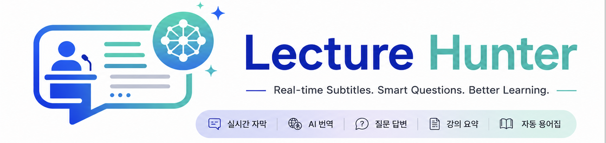
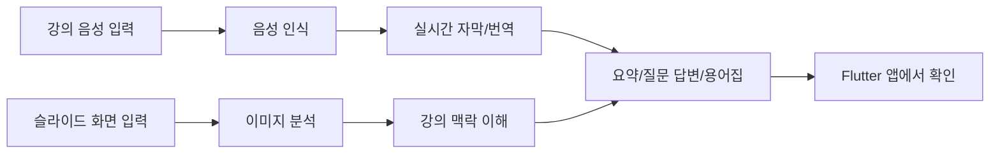

<p align="center">
  
</p>

<p align="center">
  <a href="#-시작하기">
    
  </a>
  <a href="#-사용-예시">
    
  </a>
  <br/>
  
  
  
  
  
</p>

<p align="center">
  <b>실시간 자막</b> ·
  <b>AI 번역</b> ·
  <b>강의 요약</b> ·
  <b>질문 답변</b> ·
  <b>자동 용어집</b>
</p> 

<p align="center">
  <b>🇰🇷 한국어</b>
  ·
  <a href="docs/README_en.md">🇺🇸 English</a>
  ·
  <a href="docs/README_jp.md">🇯🇵 日本語</a>
</p>


> [!NOTE]
> 🎓 **동아대학교 AI학과** SW중심대학사업 현장미러형 연계 프로젝트

> [!TIP]
> 처음 보는 분이라면 [이런 문제를 해결합니다](#-이런-문제를-해결합니다) → [핵심 기능](#-핵심-기능) → [사용 예시](#-사용-예시) 순서로 읽으면 빠르게 이해할 수 있습니다.

<br/>

## 📌 프로젝트 소개

**Lecture Hunter**는 실시간 강의를 더 쉽게 이해하고 복습할 수 있도록 도와주는 AI 기반 학습 도우미입니다.

강의 중 발생하는 음성, 슬라이드 화면, 질문 내용을 함께 분석하여 다음과 같은 기능을 제공합니다.

- 교수님 음성을 실시간 자막으로 변환
- 외국어 강의를 한국어로 번역
- 슬라이드 속 도표, 수식, 그림까지 함께 분석
- 강의 흐름을 놓쳤을 때 핵심 내용 요약
- 강의 맥락을 반영한 AI 질문 답변
- 어려운 용어를 자동으로 정리하는 용어집 제공

<br/>

## 📚 목차

- [이런 문제를 해결합니다](#-이런-문제를-해결합니다)
- [핵심 기능](#-핵심-기능)
- [사용 흐름](#-사용-흐름)
- [화면 구성](#-화면-구성)
- [사용 예시](#-사용-예시)
- [기술 스택](#-기술-스택)
- [프로젝트 구조](#-프로젝트-구조)
- [시작하기](#-시작하기)
- [개발 명령어](#-개발-명령어)
- [진행 상황](#-진행-상황)

<br/>

## 🤔 이런 문제를 해결합니다

> *"영어 강의인데 한 단어 놓치니까 그 뒤로 다 못 알아듣겠어…"*

> *"수업 중에 모르는 용어가 나왔는데, 손 들고 물어보기는 부담스러워…"*

> *"10분 늦게 들어왔는데, 지금 무슨 얘기를 하는지 모르겠어…"*

> *"복습할 때 1시간짜리 강의를 처음부터 다시 듣기는 너무 길어…"*

**Lecture Hunter는 강의 이해, 질문, 요약, 복습을 한 화면에서 도와주는 학습 보조 도구입니다.**

<br/>

## ✨ 핵심 기능

| 기능 | 설명 |
| --- | --- |
| 🎙 실시간 자막 | 강의 음성을 텍스트로 변환하여 화면에 표시합니다. |
| 🌐 실시간 번역 | 외국어 강의를 한국어로 번역하여 함께 보여줍니다. |
| 🖼 슬라이드 분석 | 슬라이드의 도표, 수식, 그림을 함께 분석하여 강의 맥락을 파악합니다. |
| 💬 강의 중 질문 | 사용자가 질문하면 지금까지의 강의 내용을 바탕으로 AI가 답변합니다. |
| 📝 핵심 요약 | 5~10분 단위로 강의 내용을 요약해 흐름을 빠르게 따라갈 수 있도록 돕습니다. |
| 📚 자동 용어집 | 수업 중 등장한 어려운 개념과 키워드를 자동으로 정리합니다. |

<br/>

## 🔄 사용 흐름



> GitHub에서 Mermaid가 보이지 않는 환경이라면 아래 흐름으로 이해하면 됩니다.
>
> **강의 입력 → 음성·슬라이드 분석 → 자막·번역 생성 → 요약·질문 답변·용어집 제공 → 앱에서 확인**

<br/>

## 🖼 화면 구성

> [!NOTE]
> 데모 스크린샷과 GIF는 추후 추가 예정입니다.

| 자막 오버레이 | 질문 패널 | 용어집 |
| --- | --- | --- |
| *스크린샷 준비 중* | *스크린샷 준비 중* | *스크린샷 준비 중* |

<br/>

## 💡 사용 예시

**상황: 영어로 진행되는 머신러닝 강의**

```text
🎤 교수님
"Now let's discuss the vanishing gradient problem..."

📺 자막 화면
원문: Now let's discuss the vanishing gradient problem...
번역: 이제 기울기 소실 문제에 대해 다뤄보겠습니다.

💬 학생 질문
"기울기 소실이 왜 문제인가요?"

🤖 AI 답변
"지금 보고 계신 슬라이드 7번 그래프처럼,
신경망이 깊어질수록 학습 신호가 앞쪽 계층까지 잘 전달되지 않아
학습이 어려워지는 현상입니다.
강의 15분 시점에서 설명한 역전파 과정과 관련이 있습니다."
```

<br/>

## 🛠 기술 스택

### 📱 Frontend

| 기술 | 역할 |
| --- | --- |
| Flutter 3.x | 모바일·데스크톱 앱 개발 |
| Dart | Flutter 앱 개발 언어 |
| Riverpod | 상태 관리 |
| WebSocket / SSE | 실시간 자막, 번역, 이벤트 수신 |

<br/>

### ⚙️ Backend

| 기술 | 역할 |
| --- | --- |
| Python 3.12 | 백엔드 개발 언어 |
| FastAPI | API 서버 구축 |
| Faster-Whisper | 음성 인식 및 자막 생성 |
| Llama 3.2 Vision | 슬라이드 이미지 분석 |
| Gemma 2 | 다국어 번역 |
| Silero VAD | 음성 구간 감지 |

<br/>

### 🗄 Database / Infra

| 기술 | 역할 |
| --- | --- |
| Supabase | 인증, 데이터 저장, API 연동 |
| PostgreSQL | 강의 데이터 저장 |
| pgvector | 강의 내용 벡터 검색 |
| Ollama | 로컬 LLM 실행 |

<br/>

## 📁 프로젝트 구조

```text
Lecture-Hunter
│
├── 📂 App/                     # FastAPI backend
│   ├── main.py
│   └── ...
│
├── 📂 Frontend/               # Flutter application
│   ├── android/
│   ├── ios/
│   ├── lib/
│   ├── web/
│   ├── macos/
│   ├── windows/
│   ├── linux/
│   ├── test/
│   ├── pubspec.yaml
│   └── analysis_options.yaml
│
├── 📂 assets/
│   └── LiveLectureLogo2.png
│
├── 📄 README.md
├── 📄 README.en.md
├── 📄 README.zh.md
├── 📄 CONTRIBUTING.md
├── 📄 CODE_OF_CONDUCT.md
├── 📄 SECURITY.md
├── 📄 LICENSE
├── 📄 Dockerfile
└── 📄 requirements.txt
```

<br/>

## 🚀 시작하기

### 1. 필요한 환경

| 항목 | 권장 버전 / 조건 |
| --- | --- |
| OS | macOS Apple Silicon 또는 NVIDIA GPU 탑재 PC 권장 |
| Python | 3.12 |
| Flutter | 3.x |
| Memory | 16GB 이상 권장 |
| 기타 | Ollama, Supabase 프로젝트 |

<br/>

### 2. 프로젝트 클론

```bash
git clone https://github.com/2022764025/Lecture-Hunter.git
cd Lecture-Hunter
```

<br/>

### 3. 백엔드 환경 설정

```bash
python3 -m venv pikmin
source pikmin/bin/activate
pip install -r requirements.txt
```

<br/>

### 4. 환경 변수 설정

```bash
cp .env.example .env
```

`.env` 파일을 열고 Supabase 및 로컬 AI 서버 정보를 입력합니다.

```env
SUPABASE_URL=your_supabase_url
SUPABASE_KEY=your_supabase_key
OLLAMA_BASE_URL=http://localhost:11434
```

<br/>

### 5. Flutter 앱 설정

```bash
cd flutter_app
flutter pub get
flutter doctor
cd ..
```

<br/>

### 6. 실행 방법

터미널을 3개로 나누어 실행하는 것을 권장합니다.

#### Terminal 1. 로컬 AI 서버 실행

```bash
ollama serve
```

#### Terminal 2. 백엔드 서버 실행

```bash
source pikmin/bin/activate
uvicorn App.main:app --reload
```

#### Terminal 3. Flutter 앱 실행

```bash
cd flutter_app
flutter run
```

<br/>

### 7. 실행 확인

정상적으로 실행되면 다음 항목을 확인합니다.

- 백엔드 서버가 `http://127.0.0.1:8000`에서 실행되는지 확인
- Flutter 앱이 에뮬레이터, 시뮬레이터, Chrome, 데스크톱 중 하나에서 실행되는지 확인
- 자막, 번역, 질문 답변 기능이 백엔드와 연결되는지 확인

<br/>

## 🧪 개발 명령어

### Flutter

```bash
cd flutter_app

# 패키지 설치
flutter pub get

# 코드 포맷팅
dart format .

# 정적 분석
flutter analyze

# 테스트
flutter test

# 앱 실행
flutter run
```

<br/>

### Backend

```bash
# 가상환경 활성화
source pikmin/bin/activate

# 서버 실행
uvicorn App.main:app --reload

# 패키지 재설치
pip install -r requirements.txt
```

<br/>

## 📊 진행 상황

### ✅ 완료된 기능

- [x] 음성 → 자막 변환 구조
- [x] 슬라이드 이미지 분석 구조
- [x] 강의 내용 기반 AI 답변 구조
- [x] WebSocket 기반 실시간 통신 구조
- [x] 다국어 번역 엔진 연동 구조

<br/>

### 🚧 작업 중인 기능

- [ ] Flutter 앱 UI 마무리
- [ ] 자동 강의 요약 기능
- [ ] 다중 사용자 동시 접속 안정성 테스트
- [ ] 학습 참여도 분석 대시보드

<br/>

### 🗓 추가 예정 기능

- [ ] 강의별 히스토리 저장
- [ ] 자막 검색
- [ ] 북마크 기능
- [ ] 사용자 설정 화면
- [ ] 강의 복습용 요약 리포트

##
