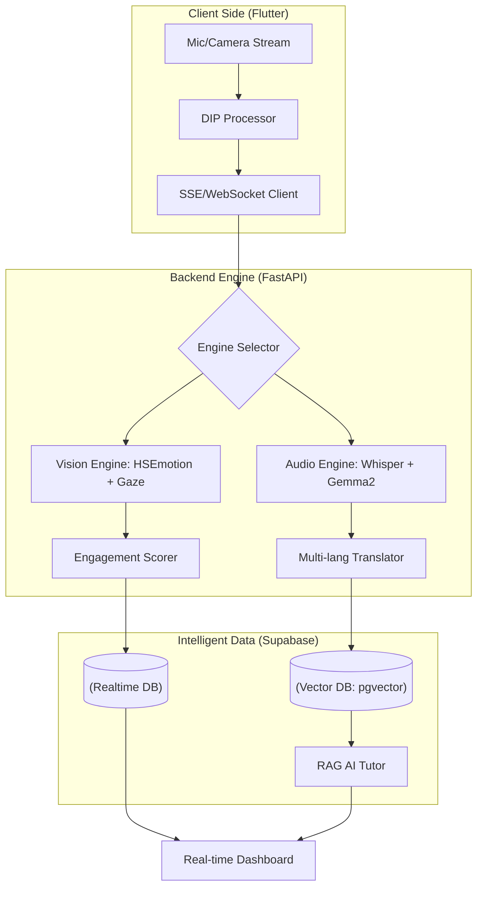

# 🎙️ LiveLectureAI
> **實證 AI 開發項目 I** > **任務獵人 (Task Hunter)** | 基於 Flutter 的實時字幕與提問組件，助力強化課堂互動

            

<p align="center">
    <a href="README.md">
        
    </a>
    <a href="README.en.md">
        
    </a>
    <a href="README.zh.md">
        
    </a>
</p>

---

## 📄 項目概述 (Project Overview)

### "基於 Flutter 的增強型課堂互動實時字幕與諮詢組件"

本項目旨在開發一個 AI 驅動的教育平台。通過對講師授課內容（音頻/視屏）和學生反應（情緒/視線）進行多模態分析，旨在消除物理距離感並實時優化學習成果。

---

## 🚀 核心功能 (4 Pillars) ##

**📊 [實時] 匿名聚合儀表板**

- **匿名性保障**: 刪除單個學生數據，僅提取全班平均專注度。

- **講師反饋**: 通過 "當前 70% 的學生感到困難" 等信息，協助講師即時調整授課速度。

**🗺️ [課後] 課件視線熱力圖**

- **視線追蹤 (Gaze Tracking)** : 將學生的注意力停留在幻燈片座標 ($x, y$) 的分佈可視化。

- **內容優化** : 識別學習者困惑的環節，為完善教學材料提供依據。

**⏱️ [複習用] 智能複習時間軸**

- **EAR & 視線偏離** : 在視頻時間軸上自動標記疲勞（打瞌睡）或視線離開的時間段。

- **精準複習** : 無需看完整個 3 小時的課程，即可高效複習錯過的片段。

**📈 [B2B] 講師績效指標與質量控制 (QC)**

- **講師評分 (Instructor Score)** : 利用結合參與度平均值與 **波動性（標準差）** 的專有算法，將授課能力量化為得分。

- **數據諮詢** : 通過分析流失點，為講師續約和內容重拍提供客觀的決策依據。

- **質量優化** : 發掘金牌講師，推動教育內容質量的標準化與高端化。

---

## 🏗️ 系統架構 (System Architecture)

本系統基於三階段流水線運行： "**實時邊緣分析 -> 雲端智能處理 -> 多語言廣播**"。



---

## 📂 數據模式與架構 (Data Schema & Architecture)

| 表名 | 關鍵字段 | 描述 |
| :--- | :--- | :--- |
| **lecture_contents** | `original`, `translated`, `target_lang`, `embedding` | 實時轉錄/翻譯數據及用於 RAG 的向量嵌入。 |
| **lecture_logs** | `engagement_score`, `emotion`, `gaze_x/y`, `ear` | 視線追蹤、情緒分析及疲勞檢測的源數據。 |
| **lecture_summaries** | `summary_text`, `key_points` | AI 生成的課程摘要及核心知識點數據。 |

---

## 🛠 技術棧與環境 (Tech Stack) ##

### 💻 開發環境

- 操作系統: macOS (Apple Silicon M1/M2/M3)

- 語言: Python `3.12+` (**不支持 Python 3.13+**)

- 框架: FastAPI (異步後端)

- 虛擬環境: venv ('pikmin')

### 🧠 AI 與機器學習 (核心)

- 🎙 語音轉文字 (STT): **faster-whisper** `(1.2.1)`

- 👁 計算機視覺: 

    - **mediapipe** `(0.10.13)`
    
    - **hsemotion-onnx** `(0.3.1)`

- 🏗 深度學習框架:

    - **tensorflow-macos** `(2.16.1)` / **keras** `(3.13.2)`
    
    - **torch** `(2.10.0)` / **torchvision** `(0.25.0)`

    - **jax** `(0.4.26)`

- 🤖 LLM / RAG:

    - **ollama** `(0.6.1)`
    
    - **ctranslate2** `(4.7.1)`

- 🧮 數學工具:

    - **numpy** `(1.26.4)`
    
    - **scipy** `(1.17.1)`
    
    - **sympy** `(1.14.0)`
      
### 🌐 後端與通信

- ⚡ API 服務器:

    - **fastapi** `(0.135.1)` 
    
    - **uvicorn** `(0.41.0)`

- ☁️ 數據庫 / 認證: **supabase** `(2.28.0)` (集成 Postgrest, Auth, Functions)

- 🔌 實時通信: 

    - **websockets** `(15.0.1)`

    - **sse-starlette**

- 🛰 異步客戶端:

    - **httpx** `(0.28.1)`
    
    - **anyio** `(4.12.1)`

### 🎙 音頻與工具

- 🎧 音頻處理:

    - **sounddevice** `(0.5.5)`
    
    - **av** `(16.1.0)`

- 🛡 數據驗證: **pydantic v2** `(2.12.5)`

- 📝 環境配置: **python-dotenv** `(1.2.2)`

---

## ✅ 項目里程碑與檢查清單 (Updated 2026.04.09) ##

**1️⃣ 多模態 AI 引擎 (核心)**

- [x] 高性能視覺分析: 構建了 `HSEmotion` + `DIP(Sobel, DoG)` 混合邏輯。

- [x] 視線穩定化: 通過 EMA 濾波器和非線性加速提高了視線追蹤精度。

- [x] 智能語音識別 (STT): 實現了基於 Whisper (Medium) 的多語言自動檢測。

- [x] 動態翻譯引擎: 集成了基於 Gemma2 的用戶可選目標語言翻譯系統。

- [x] VAD 語音檢測: 應用 Whisper VAD 濾波器以防止幻覺並優化靜音處理。

**2️⃣ 後端與智能架構 (Architecture)**

- [x] 後端架構設計: 完成了基於 FastAPI 的 SSE 流式傳輸與 RAG 服務結構化。

- [x] 向量 RAG 引擎: 利用 Supabase Vector 建立課堂內容嵌入與相似度檢索。

- [x] 上下文感知問答: 完成了具備前序課程上下文記憶功能的 RAG 服務邏輯。

- [x] 數據模式優化: 新增 `target_lang` 字段並完善多語言數據存儲結構。

**3️⃣ 高性能擴展 (測試與部署)**

- [ ] vLLM 高性能部署: 正在測試用於在 GPU 服務器上部署 Gemma2-9B/27B 的 vLLM 引擎。

- [ ] 硬件加速: 通過 Whisper Large-v3 和 CUDA 加速最大化實時處理性能。

- [ ] 並發基準測試: 測量多用戶同時訪問時的吞吐量與延遲。

- [ ] 課程分析報告生成: 完成基於參與度數據的自動報告生成 API。

**4️⃣ 前端集成 (Flutter)**

- [ ] SSE 實時通信對接: 測試在 Flutter 客戶端實時接收並可視化後端分析數據

- [ ] 實時多語言字幕 UI: 實現目標語言選擇組件及流式字幕查看器 UI

- [ ] 專注度儀表板組件: 開發實時參與度圖表及視線熱力圖可視化組件

---

## ⚙️ 入門指南 ##

**安裝 (Installation)**
```Bash
git clone https://github.com/2022764025/Lecture-Hunter.git
cd LiveLectureAI
python3 -m venv pikmin
source pikmin/bin/activate
pip install -r requirements.txt
```

**運行 (Usage)**
```Bash
# 啟動 FastAPI 服務器
uvicorn App.main:app --reload

# 運行視覺引擎測試 (本地)
python3 services/test_vision.py
```

---

## 📄 許可證 (License) ##

**MIT License**