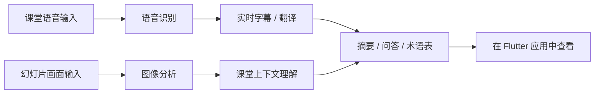

<p align="center">
  
</p>

<p align="center">
  <a href="#-快速开始">
    
  </a>
  <a href="#-使用示例">
    
  </a>
  <br/>
  
  
  
  
  
</p>

<p align="center">
  <b>用于课堂互动的 Flutter 实时字幕与提问组件开发</b>
</p>

<p align="center">
  <a href="../README.md">🇰🇷 한국어</a>
  ·
  <a href="README_en.md">🇺🇸 English</a>
  ·
  <b>🇨🇳 中文</b>
  ·
  <a href="README_jp.md">🇯🇵 日本語</a>
</p>

> [!NOTE]
> 🎓 **东亚大学 AI 学科**
> SW 中心大学事业现场镜像型联动项目

> [!TIP]
> 如果你是第一次了解本项目，建议按照以下顺序阅读：
> [我们解决的问题](#-我们解决的问题) → [核心功能](#-核心功能) → [使用示例](#-使用示例)

<br/>

### 📌 项目介绍

**Lecture Hunter** 是一款基于 AI 的学习辅助工具，帮助学生更轻松地理解实时课堂内容，并在课后高效复习。

它会综合分析课堂中的语音、幻灯片画面和学生问题，并提供以下功能：

* 将教师语音实时转换为字幕
* 将外语授课内容翻译为韩语
* 分析幻灯片中的图表、公式和图片
* 当学生错过课堂内容时，提供重点摘要
* 根据课堂上下文回答学生问题
* 自动整理课堂中出现的难懂术语和关键词

<br/>

### 📚 目录

* [我们解决的问题](#-我们解决的问题)
* [核心功能](#-核心功能)
* [使用流程](#-使用流程)
* [界面构成](#-界面构成)
* [使用示例](#-使用示例)
* [技术栈](#-技术栈)
* [项目结构](#-项目结构)
* [快速开始](#-快速开始)
* [开发命令](#-开发命令)
* [当前前端连接状态](#-当前前端连接状态)
* [开发进度](#-开发进度)

<br/>

### 🤔 我们解决的问题

> *“这节课是英语授课，只要漏听一个单词，后面的内容就完全跟不上了……”*

> *“课堂上出现了不懂的术语，但又不好意思举手提问……”*

> *“迟到了 10 分钟进入课堂，现在完全不知道老师讲到哪里了……”*

> *“复习时重新看一小时的课程视频太耗时间了……”*

**Lecture Hunter 在一个界面中帮助学生完成课堂理解、提问、摘要和复习。**

<br/>

### ✨ 核心功能

| 功能       | 说明                             |
| -------- | ------------------------------ |
| 🎙 实时字幕  | 将课堂语音转换为文本，并显示在屏幕上。            |
| 🌐 实时翻译  | 将外语授课内容实时翻译为韩语并同步显示。           |
| 🖼 幻灯片分析 | 分析幻灯片中的图表、公式和图片，理解课堂上下文。       |
| 💬 课堂提问  | 当学生提问时，AI 会基于目前为止的课堂内容进行回答。    |
| 📝 重点摘要  | 每隔 5–10 分钟总结课堂重点，帮助学生快速跟上课堂节奏。 |
| 📚 自动术语表 | 自动整理课堂中出现的难懂概念和关键词。            |

<br/>

### 🔄 使用流程



> 如果 GitHub 环境中无法显示 Mermaid 图表，可以按照以下流程理解：
>
> **课堂输入 → 语音与幻灯片分析 → 字幕与翻译生成 → 摘要、问答和术语表提供 → 在应用中查看**

<br/>

### 🖼 Demo Host 基础组件界面构成

<p align="center">
  <table>
    <tr>
      <th align="center">字幕浮层</th>
      <th align="center">术语表组件</th>
      <th align="center">课堂 AI 提问面板</th>
    </tr>
    <tr>
      <td align="center">
        
      </td>
      <td align="center">
        
      </td>
      <td align="center">
        
      </td>
    </tr>
    <tr>
      <th align="center">字幕设置</th>
      <th align="center">字幕历史</th>
      <th align="center">-</th>
    </tr>
    <tr>
      <td align="center">
        
      </td>
      <td align="center">
        
      </td>
      <td align="center">-</td>
    </tr>
  </table>
</p>

<br/>

### 💡 使用示例

**场景：一节用英语进行的机器学习课程**

```text
🎤 教授
"Now let's discuss the vanishing gradient problem..."

📺 字幕画面
原文: Now let's discuss the vanishing gradient problem...
翻译: 现在我们来讨论梯度消失问题。

💬 学生提问
“为什么梯度消失是一个问题？”

🤖 AI 回答
“就像当前第 7 页幻灯片中的图表所示，
神经网络越深，学习信号越难传递到前面的层，
因此模型训练会变得困难。
这与课程第 15 分钟左右讲到的反向传播过程有关。”
```

<br/>

### 🛠 技术栈

### 📱 Frontend

| 技术              | 作用                  |
| --------------- | ------------------- |
| Flutter 3.x     | 开发基于 Web 的实时字幕浮层 UI |
| Dart            | Flutter 应用开发语言      |
| Riverpod        | 管理字幕、主题和提问面板状态      |
| HTTP API        | 准备连接提问、术语表和摘要 API   |
| SSE / WebSocket | 准备实时字幕接收与音频流传输      |

<br/>

### ⚙️ Backend

| 技术               | 作用        |
| ---------------- | --------- |
| Python 3.12      | 后端开发语言    |
| FastAPI          | API 服务器构建 |
| Faster-Whisper   | 语音识别与字幕生成 |
| Llama 3.2 Vision | 幻灯片图像分析   |
| Gemma 2          | 多语言翻译     |
| Silero VAD       | 语音活动检测    |

<br/>

### 🗄 Database / Infra

| 技术         | 作用                |
| ---------- | ----------------- |
| Supabase   | 身份认证、数据存储和 API 集成 |
| PostgreSQL | 课堂数据存储            |
| pgvector   | 课堂内容向量检索          |
| Ollama     | 本地 LLM 运行环境       |

<br/>

### 📁 项目结构

```text
Lecture-Hunter
│
├── 📂 App/                     # FastAPI backend
│   ├── main.py
│   ├── api/
│   ├── core/
│   ├── services/
│   ├── setup_db.sql
│   └── ...
│
├── 📂 Frontend/                # Flutter application
│   ├── android/
│   ├── ios/
│   ├── lib/
│   │   ├── core/
│   │   ├── features/
│   │   │   ├── assistant/
│   │   │   ├── caption/
│   │   │   └── overlay/
│   │   ├── services/
│   │   ├── shared/
│   │   └── main.dart
│   ├── web/
│   ├── macos/
│   ├── windows/
│   ├── linux/
│   ├── pubspec.yaml
│   └── analysis_options.yaml
│
├── 📂 assets/
│   └── LectureHunter_Logo3.jpeg
│
├── 📄 README.md
├── 📄 README.en.md
├── 📄 README.zh.md
├── 📄 CONTRIBUTING.md
├── 📄 CODE_OF_CONDUCT.md
├── 📄 SECURITY.md
├── 📄 LICENSE
├── 📄 Dockerfile
└── 📄 requirements.txt
```

<br/>

### 🚀 快速开始

### 1. 环境要求

| 项目      | 推荐版本 / 条件                                  |
| ------- | ------------------------------------------ |
| OS      | 推荐 macOS Apple Silicon 或搭载 NVIDIA GPU 的 PC |
| Python  | 3.12                                       |
| Flutter | 3.x                                        |
| Memory  | 推荐 16GB 以上                                 |
| 其他      | Ollama、Supabase 项目                         |

<br/>

### 2. 克隆项目

```bash
git clone https://github.com/2022764025/Lecture-Hunter.git
cd Lecture-Hunter
```

<br/>

### 3. 后端环境设置

```bash
python3 -m venv pikmin
source pikmin/bin/activate
pip install -r requirements.txt
```

<br/>

### 4. 环境变量设置

```bash
cp .env.example .env
```

打开 `.env` 文件，并填写 Supabase 与本地 AI 服务器相关信息。

```env
SUPABASE_URL=your_supabase_url
SUPABASE_ANON_KEY=your_supabase_anon_key
LLM_MODEL=gemma2:2b
VLM_MODEL=llama3.2-vision:11b
WHISPER_MODEL_SIZE=medium
WHISPER_DEVICE=auto
VAD_THRESHOLD=0.3
```

<br/>

### 5. Flutter 应用设置

```bash
cd Frontend
flutter pub get
flutter doctor
cd ..
```

<br/>

### 6. 运行方法

建议将终端分为 3 个窗口分别运行。

### Terminal 1. 运行本地 AI 服务器

```bash
ollama serve
```

### Terminal 2. 运行后端服务器

```bash
source pikmin/bin/activate
uvicorn App.main:app --reload
```

### Terminal 3. 运行 Flutter 应用

```bash
cd Frontend
flutter run -d chrome
```

<br/>

### 7. 运行确认

项目正常运行后，请确认以下内容：

* 后端服务器是否运行在 `http://127.0.0.1:8000`
* Flutter 应用是否在 Chrome 中正常启动
* LiveLectureAI 画面是否正常显示
* 字幕浮层、提问面板、术语表 UI 是否显示
* 当前前端已完成基于 Mock 的 UI 行为验证
* 实际后端连接将在 API 路径一致性修改后进行

<br/>

### 🧪 开发命令

### Flutter

```bash
cd Frontend

# 安装依赖
flutter pub get

# 代码格式化
dart format .

# 静态分析
flutter analyze

# 运行应用
flutter run -d chrome
```

<br/>

### Backend

```bash
# 激活虚拟环境
source pikmin/bin/activate

# 运行服务器
uvicorn App.main:app --reload

# 重新安装依赖
pip install -r requirements.txt
```

<br/>

### 🔌 当前前端连接状态

当前前端已完成基于 Mock 的 UI 行为验证，正在进行与实际后端端点的 API 路径一致性调整。

### 已确认项目

* 已确认 `api_service.dart` 的后端 HTTP 调用结构
* 已确认 `sse_service.dart` 的实时字幕流接收结构
* 已确认 `caption_controller.dart` 的 Provider 连接结构
* 已确认 `overlay_page.dart` 的 Mock / 实际服务器切换结构
* 已确认实际后端端点列表

### 当前前端连接结构

* 基于 `ApiService` 的 HTTP API 调用结构
* 基于 `SseService` 的实时字幕流接收结构
* 已注册 `sseServiceProvider`
* 已连接 `connectionStatusProvider`
* 已连接 `subtitleStreamProvider`
* 基于 `currentSubtitleProvider` 的最新字幕显示结构
* 支持 Mock 模式 / 实际服务器连接切换结构

### 已确认的路径不一致

| 分类      | 当前前端路径                        | 当前后端路径                      |
| ------- | ----------------------------- | --------------------------- |
| 提问 API  | `POST /api/v1/qa/ask`         | `GET /lecture/ask`          |
| 术语表 API | `GET /api/v1/glossary/search` | 后端端点未确认                     |
| 实时字幕接收  | `GET /api/v1/subtitle/stream` | `WS /ws/audio/{lecture_id}` |

### 后续修改计划

* 修改 `api_service.dart` 中的提问 API 路径
* 确认 `/lecture/ask` 的请求方式与参数结构
* 确认是否需要新增术语表 API 后端端点
* 决定是否保留 `sse_service.dart`
* 将后端 WebSocket 结构与前端实时字幕接收结构进行匹配

<br/>

### 📊 开发进度

### ✅ 已完成功能

* [x] 语音转字幕后端结构
* [x] 幻灯片图像分析后端结构
* [x] 基于课堂内容的 AI 回答后端结构
* [x] FastAPI WebSocket 音频接收结构
* [x] 多语言翻译引擎集成结构
* [x] Flutter 实时字幕 UI 结构
* [x] Flutter Mock 字幕流结构
* [x] Flutter API/SSE 服务层结构
* [x] Flutter feature-based 文件夹结构整理
* [x] Flutter 主要 UI 按钮行为确认
* [x] Flutter analyze No issues found 确认

<br/>

### 🚧 开发中的功能

* [ ] STT/API/SSE 实际连接路径一致性修改
* [ ] 提问 API `/lecture/ask` 前端连接
* [ ] 新增术语表 API 端点或修改前端路径
* [ ] 决定实时字幕接收方式：保留 SSE 或切换为 WebSocket
* [ ] Flutter 应用 UI 收尾
* [ ] 自动课堂摘要功能
* [ ] 多用户同时访问稳定性测试
* [ ] 学习参与度分析仪表板

<br/>

### 🗓 后续计划功能

* [ ] 按课程保存历史记录
* [ ] 字幕搜索
* [ ] 书签功能
* [ ] 用户设置页面
* [ ] 课堂复习用摘要报告
* [ ] 用于外部网站应用的 iframe 结构 بررسی
* [ ] 基于 Chrome Extension 的浮层应用结构 검토
