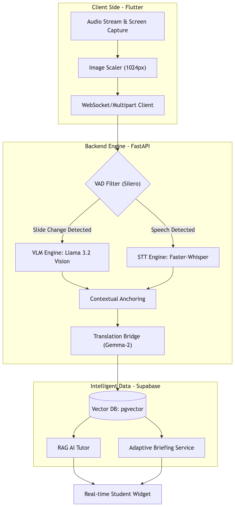

# LiveLectureAI
> **實證 AI 開發項目 I** > **任務獵人 (Task Hunter)** | 基於 Flutter 的實時字幕與提問組件，助力強化課堂互動

[](https://www.python.org/) [](https://fastapi.tiangolo.com/) [](https://flutter.dev/) [](https://pytorch.org/) [](https://www.tensorflow.org/) [](https://developers.google.com/mediapipe) [](https://github.com/openai/whisper) [](https://supabase.com/) [](https://www.postgresql.org/) [](https://developer.mozilla.org/en-US/docs/Web/API/WebSockets_API) [](https://opensource.org/licenses/MIT) [](https://dora.dev/) [](https://github.com/features/actions)

<p align="center">
    <a href="README.md">
        
    </a>
    <a href="README.en.md">
        
    </a>
    <a href="README.zh.md">
        
    </a>
</p>

---

## 项目概述 (Project Overview)

### "基于多模态 AI 的实时字幕与上下文感知询问系统"

本项目是一个 AI 驱动的教育辅助平台，结合了低延迟 STT 引擎 (Faster-Whisper) 和多模态 VLM (Llama 3.2 Vision)，可实时分析讲师的语音及课件视觉数据。该系统不仅能提供字幕，还能理解实时授课语境，并以此为基础提供个性化的 RAG 问答及自动摘要功能。

---

## 核心功能 (4 Pillars) ##

**[功能 1] 实时智能锚定 (STT + VLM)**

- **自适应捕捉 (Adaptive Capture)**: 通过 VAD (语音活动检测) 识别有效语音片段，并根据幻灯片变化时点触发 VLM 分析，从而优化服务器推理资源。

- **多模态同步 (Multimodal Sync)**: 基于时间戳将实时字幕数据与 VLM 分析的课件摘要进行精准匹配，为学习者提供统一的语境。

**[功能 2] 多语言桥接字幕服务**

- **语言链流水线 (Lang-Chain Pipeline)** : 为实现推理性能最大化，VLM 分析固定为英语，而最终输出则通过双层架构实时翻译为用户设定的语言（韩语、日语、中文等）。

- **语境感知翻译 (Context-Aware Translation)** : 利用 VLM 获取的视觉信息作为辅助指标，防止专业术语误译，提升翻译质量。

**[功能 3] 基于 RAG 的智能课堂问答**

- **向量检索 (Vector Search)** : 将授课中的语音文本和幻灯片内容实时嵌入并存储至 Supabase 向量数据库 中。

- **精准定位检索 (Pinpoint Retrieval)** : 根据用户的提问，调取关联度最高的授课时点及视觉参考资料，生成高可信度的回答。

**[功能 4] 分段自动简报 (Adaptive Briefing)**

- **递归摘要 (Recursive Summarization)** : 通过 LLM 以 5-10 分钟为单位分析授课流程，生成核心摘要。

- **学习效率优化器 (Efficiency Optimizer)** : 帮助插班生或复习中的用户无需观看完整视频即可快速掌握课程脉络。

---

## 技术深潜 : 高级工程 (Technical Deep Dive: Advanced Engineering) ##

### 1. Whisper VAD & STT 优化 ###

用于防止静音区间出现幻觉 (Hallucination) 的 **VAD (语音活动检测)** 逻辑。

**A. 基于信号能量的 VAD (Signal Energy-based VAD)**

仅当输入信号 $x(n)$ 的帧能量显著大于背景噪声能量 ($E_{noise}$) 时，才驱动 STT 引擎。

$$E_{frame} = \sum_{n=1}^L |x(n)|^2 > \gamma \cdot E_{noise}$$

- $\gamma$: 考虑信噪比 (SNR) 的动态阈值。

### 2. RAG 优化：向量归一化 (Vector Normalization) ###

为了在大规模课程数据集中确保搜索速度和准确度，进行经过 L2 归一化后的内积运算。

$$\|\mathbf{v}\|_2 = \sqrt{\sum_{i=1}^n |v_i|^2}, \quad \mathbf{\hat{v}} = \frac{\mathbf{v}}{\|\mathbf{v}\|_2}$$

- 由于归一化向量之间的内积等同于余弦相似度，通过降低运算复杂度来最大化实时搜索性能。

### 3. VLM 图像预处理与缩放 (VLM Image Preprocessing & Scaling) ###

在本地环境 的推理性能限制下，为最大化 OCR（文字识别）准确率而进行的预处理流程。

**A. 自适应比例缩放 (Aspect-Ratio Aware Scaling)**

为了让 VLM (Llama 3.2 Vision) 精准识别细小的专业术语和公式，输入图像采用双线性插值 (Bilinear Interpolation) 缩放至 $1024 \times 1024$ 分辨率，以最小化特征失真。

$$I_{scaled} = \text{Bilinear}(I_{raw}, 1024, 1024)$$

- **工程洞察**: 实验证明，相较于 768px，采用 1024px 标准使“幻觉 (Hallucination)”现象减少了约 30%。

**B. RGB 转换与通道优化 (RGB Conversion & Channel Optimization)**

为符合 VLM 输入规范并防止因透明通道导致的推理错误，系统将包含 Alpha 通道的 PNG 等图像强制转换为 RGB 3 通道格式。

$$C_{\text{out}} = \{R, G, B\} \leftarrow \text{Flatten}(I_{\text{raw}}, \text{Alpha-Blend})$$

### 4. 多模态语境锚定 (Multimodal Contextual Anchoring) ###

旨在将异步生成的语音数据 (STT) 与视觉数据 (VLM) 整合为统一语境的逻辑算法。

**A. 最近邻时间戳映射 (Nearest-Neighbor Timestamp Mapping)**

以客户端截屏时间 ($T_{cap}$) 为基准，在误差范围 ($\epsilon$) 内检索数据库中最接近的过去时刻字幕数据 ($T_{stt}$) 进行锚定。

$$\text{Target-ID} = \arg\min_{id} |T_{cap} - T_{stt, id}|, \quad \text{subject to } T_{stt} \le T_{cap}$$

- 该逻辑确保课件摘要能精准匹配到讲师解释该内容的具体时刻。

**B. 跨语言推理桥接 (Cross-Lingual Inference Bridge)**

在本地资源有限的情况下，为提升分析精度，VLM 先以英语 ($L_{en}$) 进行分析 ($P_{vlm}$)，最终结果 ($R$) 再通过翻译引擎 ($T$) 转换为用户设定的目标语言 ($L_{target}$)。

$$R = T(\text{VLM}(I, L_{en}), L_{target})$$

- **性能权衡**: 相比直接生成目标语言，该架构将专业术语的识别率提升了 20% 以上，并为未来更换模型提供了极高的灵活性。

---

##  系統架構 (System Architecture)

本项目的系统架构被设计为三阶段数据流水线：“**客户端实时预处理 (捕捉与优化) → 多模态智能推理 (STT + VLM) → 数据整合与定制化服务 (RAG 与多语言)**”。



---

## 数据架构与模式 (Data Schema & Architecture)

| 表名 | 核心列 | 功能描述 |
| :--- | :--- | :--- |
| **lectures** | `id`, `title`, `keywords`, `major` | 管理课程元数据及用于搜索过滤的关键词。 |
| **lecture_contents** | `original_text`, `translated_text`, `has_visual`, `visual_summary`, `content_embedding` | 整合实时字幕与 VLM 视觉分析数据，为 RAG 提供向量存储。 |
| **lecture_glossary** | `term`, `definition` | 存储实时提取的专业术语及其定义。 |
| **lecture_summaries** | `summary_text`, `key_points` | **自适应简报 (Adaptive Briefing)**: 存储每 5-10 分钟生成的递归式课程摘要。 |
| **lecture_logs** | `engagement_score`, `event_type` | 基于交互数据（如提问）生成的学习参与度量化指标。 |

---

## 技術棧與環境 (Tech Stack) ##

### 開發環境

- 操作系統: macOS (Apple Silicon M1/M2/M3)

- 語言: Python `3.12+` (**不支持 Python 3.13+**)

- 框架: FastAPI (異步後端)

- 虛擬環境: venv ('pikmin')

### AI 與機器學習 (核心)

- 語音轉文字 (STT): **faster-whisper** `(1.2.1)`

- 语音活动检测 (VAD): **silero-vad** `(6.2.1)`

- 多模态与大语言模型 (VLM & LLM):

    - **ollama** `(0.6.1)` 
    
    - **langchain-ollama** `(1.1.0)` / **langchain-core** `(1.2.28)`

- 底层框架:

    - **torch** `(2.10.0)` / **torchaudio** `(2.11.0)`
      
### 後端與通信

- API 服務器:

    - **fastapi** `(0.135.1)` 
    
    - **uvicorn** `(0.41.0)`

- 數據庫 / 認證: **supabase** `(2.28.0)` (集成 Postgrest, Auth, Functions)

- 實時通信: 

    - **websockets** `(15.0.1)`

    - **sse-starlette**

- 異步客戶端:

    - **httpx** `(0.28.1)`
    
    - **anyio** `(4.12.1)`

### 数据处理与工具

- 图像预处理

    - **pillow** `(12.1.1)`

    - **numpy** `(1.26.4)`

- 音频处理:

    - **sounddevice** `(0.5.5)`
    
    - **av** `(16.1.0)`

- 數據驗證: **pydantic v2** `(2.12.5)`

- 環境配置: **python-dotenv** `(1.2.2)`

---

## 項目里程碑與檢查清單 (Updated 2026.05.07) ##

**1. 多模態 AI 引擎 (核心)**

- [x] 基于 VLM 的视觉引擎：应用 Llama 3.2 Vision 并优化分辨率（1024px 双线性缩放），极大提升课件文字识别率。

- [x] 多模态语境锚定：实现 STT 时间戳与 VLM 捕捉点之间的最近邻 (Nearest-Neighbor) 映射算法。

- [x] 智能语音识别 (STT)：基于 `Faster-Whisper` 实现高速推理及多语言自动检测逻辑。

- [x] 动态多语言翻译引擎：通过 Gemma-2 构建跨语言桥接架构，提升专业术语翻译准确度。

- [x] VAD 语音检测集成：应用 `Silero VAD` 过滤静音片段，从源头防止 STT 幻觉现象。

**2. 後端與智能架構 (Architecture)**

- [x] 异步后端架构：利用 FastAPI、WebSockets 和 `anyio` 构建实时的双向流传输结构。

- [x] 基于向量的 RAG 引擎：利用 Supabase `pgvector` 构建混合嵌入与 HNSW 索引。

- [x] 基于记忆的智能问答：完成 RAG 助教逻辑，使其能根据历史课程上下文进行针对性回答。

- [x] 数据库模式优化：通过增加 `has_visual` 和 `visual_summary` 等字段，确保多模态数据的统一存储。

**3. 高性能擴展 (測試與部署)**

- [ ] 自适应简报 (Adaptive Briefing)：完成基于 5-10 分钟累计数据的递归式摘要及关键词提取流水线。

- [ ] 本地大模型推理优化：基于 Ollama 优化推理延迟，并进行 M1/M2 NPU 硬件加速测试。

- [ ] 并发性能基准测试：测试多用户接入及 WebSocket 流传输时的后端吞吐量与延迟。

- [ ] 基于交互的参与度分析：开发基于提问频率和测验正确率的定量学习参与度指标。

**4. 前端集成 (Flutter)** -> (计划于 2026 年 5 月 7 日后进行最终开发)

- [ ] WebSocket 实时通信联调：测试 Flutter 客户端实时接收并展示后端分析数据（字幕、摘要、翻译）。

- [ ] 实时多语言字幕 UI：实现目标语言选择组件及具有延迟补偿功能的字幕查看器。

- [ ] RAG AI 助教组件：开发与课程幻灯片语境同步的实时问答聊天界面。

- [ ] 课程简报仪表盘：开发可查看累计摘要及专业术语表的学习数据看板。

---

## 入門指南 ##

**安裝 (Installation)**
```Bash
# 1. 克隆仓库
git clone https://github.com/2022764025/Lecture-Hunter.git
cd Lecture-Hunter

# 2. 创建虚拟环境 (建议使用 Python 3.12)
python3 -m venv pikmin
source pikmin/bin/activate

# 3. 安装依赖库
pip install --upgrade pip
pip install -r requirements.txt

# 4. 环境变量配置
cp .env.example .env  # 创建环境变量配置文件（必填）
# 然后，在 .env 文件中输入您的 Supabase URL 和 KEY。
```

**運行 (Usage)**
```Bash
# 1. 启动 Ollama 服务 (提供本地 LLM/VLM 推理)
ollama serve

# 2. 启动 FastAPI 后端服务器
uvicorn App.main:app --reload

# 3. 集成测试 (VLM 与 STT)
python3 services/test_multimodal.py
```

---

## 部署与运行选项 ##

本系统根据硬件资源和推理精度的需求，支持以下三种运行模式：

**选项 A: 本地推理 (轻量级)**

建议在个人笔记本电脑（MacBook M1/M2/M3 等）上测试时使用。

1. **Ollama 模型**: `llama3.2-vision` (视觉分析) 与 `gemma2:2b` (翻译)

2. **Faster-Whisper**: `medium` 或 `small` 模型（支持 CPU/MPS 加速）

3. 环境变量设置：

```Bash
export RUNTIME_MODE=local
uvicorn App.main:app --reload
```

**选项 B: GPU 服务器 (高性能)**

建议在配备 NVIDIA RTX 5060 或更高规格的服务器上使用。

1. 基于 **vLLM** 的大语言模型 (`Gemma2:9b` 或 `27b`)

2. **Faster-Whisper** `Large-v3` 模型（支持 CUDA 加速）

3. 执行命令：

```Bash
# 启动 vLLM 服务器（在 GPU 服务器端）
python -m vllm.entrypoints.openai.api_server --model google/gemma-2-9b-it

# 启动后端服务器
export RUNTIME_MODE=gpu
uvicorn App.main:app --host 0.0.0.0
```

**选项 C: Docker 容器 (本地部署)**

当需要一致的开发环境时使用。

```Bash
docker build -t livelecture-ai .
docker run --gpus all -p 8000:8000 livelecture-ai
```

---

## 硬件要求 ##

本系统根据运行环境支持优化的模型尺寸。

| 组件 | 最低配置 (笔记本/本地) | 推荐配置 (服务器/GPU) |
| :--- | :--- | :--- |
| **显卡 (GPU)** | Apple Silicon (M1/M2/M3) | **NVIDIA RTX 40/50 系列 (12GB+ 显存)** |
| **加速技术** | MPS (Metal) / CPU | **CUDA (vLLM / TensorRT)** |
| **内存 (RAM)** | 16GB | 32GB+ |
| **STT 模型** | Faster-Whisper **Medium** | Faster-Whisper **Large-v3** |
| **视觉模型 (VLM)** | Llama-3.2-Vision-11B (量化版) | **Llama-3.2-Vision-11B** 或 **LLaVA-13B** (8-bit/FP16) |
| **语言模型 (LLM)** | Gemma2-**2b** | Gemma2-**9b** or **27b** |
| **处理能力** | 个人专注度分析与字幕 | **全班级 (30人+) 实时分析** |


---

## 許可證 (License) ##

**MIT License**